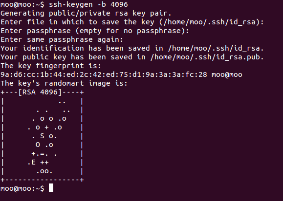
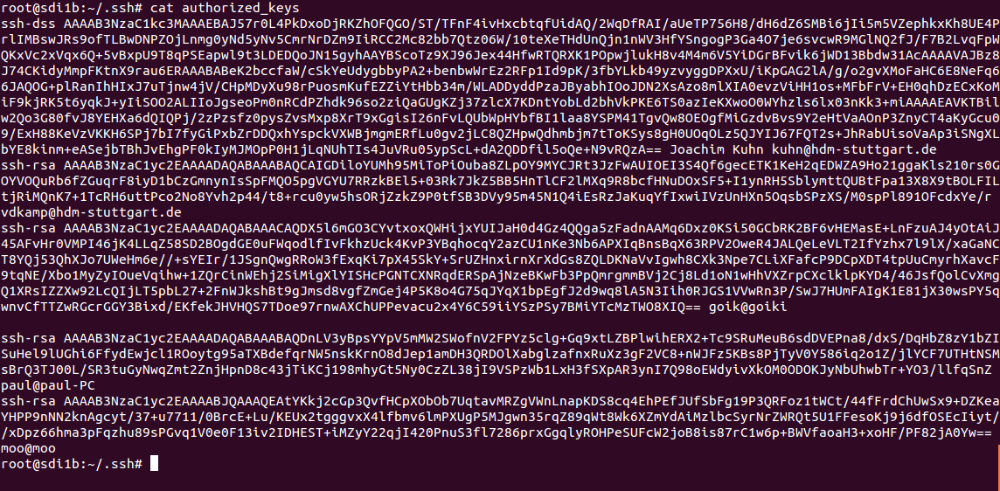
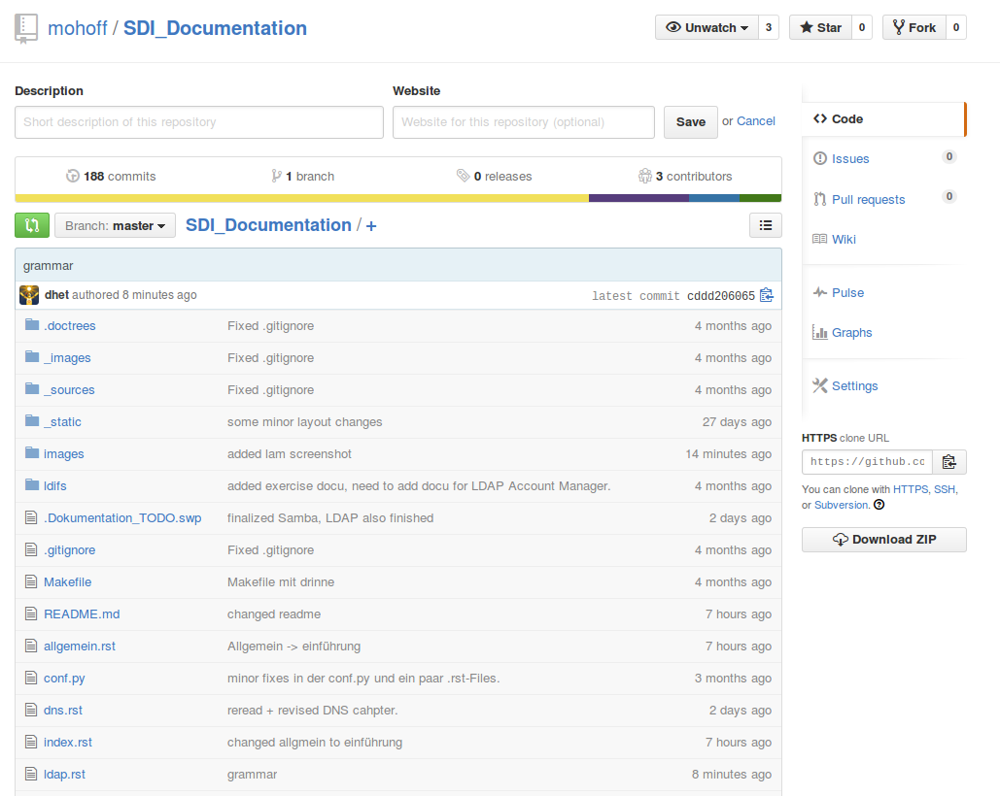
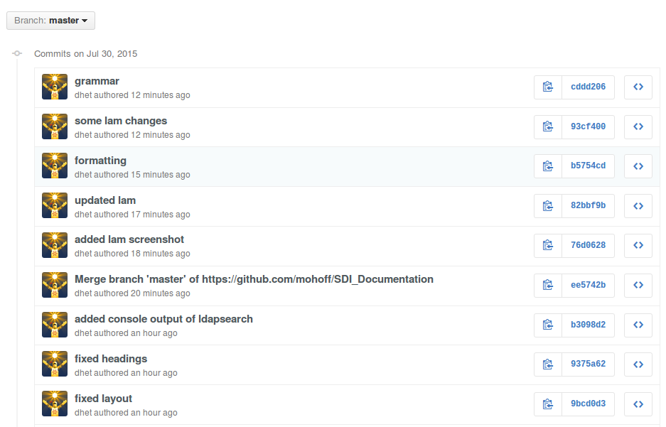
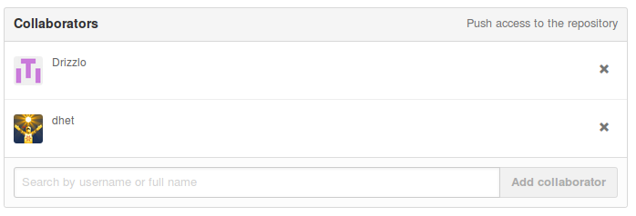
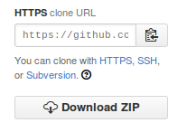

**********
Einführung
**********

Die vorliegende Dokumentation wurde im Rahmen der Vorlesung **Software Defined Infrastructure** bei Herrn Goik an der Hochschule der Medien erstellt. Gegenstand der Vorlesung waren die Themen:

1. Genereller Umgang mit Linux, Dokumentations-Tools und Git
2. LDAP
3. DNS
4. Apache Webserver
5. Samba
6. Nagios

Für jedes dieser Themengebiete wurden in Gruppen à 2-3 Studenten Aufgaben bearbeitet und die Vorgehensweise zur Lösung der Problemstellungen auf dieser Webseite dokumentiert.

Einrichtung der Arbeitsumgebung
*******************************

Für die Bearbeitung der Aufgaben stand jedem Studenten eine eigene virtuelle Maschine (VM) zur Verfügung, auf die mit SSH zugegriffen wurde. Ursprünglich war der Zugriff auf alle virtuellen Maschinen mit demselben Passwort "gesichert". Die erste Aufgabe zur Vorbereitung war es eine Public-Key-Authentifizierung einzurichten und die Passwortauthentifizierung zu deaktivieren.

Auf den Poolrechnern wurde zu diesem Zweck zunächst ein 4096 bit-Schlüsselpaar mit dem Befehl

::

    ``ssh-keygen -b 4096``

erzeugt.

Während dieses Vorgangs kann ein Passwort zur Sicherung des Private Keys sowie dessen Dateiname angegeben werden. Beide generierte Schlüssel werden standardmäßig im Verzeichnis ``~/.ssh/`` abgelegt.  Als Name sollten die Standards ``id_rsa`` für den privaten Schlüssel und ``id_rsa.pub`` für den öffentlischen Schlüssel gewählt werden, damit der SSH-Client diesen automatisch verwendet. Andernfalls muss der Pfad zu dem Schlüssel bei der Anmeldung manuell angegeben werden: ``ssh user@server -i /pfad/zum/schluessel``.

Der *Public Key* kann beliebig verteilt werden. Der *Private Key* muss geheim gehalten werden und soll dazu dienen, den Ersteller in Kombination mit dem Public Key eindeutig zu identifizieren.

Anschließend wurde der Public Key mit dem Tool ``scp`` auf die jeweiligen VMs kopiert und in der ``authorized_keys``-Datei im ``~/.ssh``-Verzeichnis pro VM hinzugefügt. In dieser Datei sind die öffentlichen Schlüssel aller für den SSH-Zugriff berechtigten Benutzer aufgelistet:

Da die Authentifizierung fortan ausschließlich mit Schlüsseln erfolgen sollte, wurde die Passwort-Authentifizierung gänzlich deaktiviert. Hierfür wurde der entsprechende Eintrag in der Konfigurationsdatei ``/etc/ssh/sshd_config`` editiert:

::

    PasswordAuthentication no

Für die Verwendung von SSH war anschließend keine Passworteingabe mehr nötig.

::

    ssh root@sdi2b.mi.hdm-stuttgart.de
    Welcome to Ubuntu 14.04.2 LTS (GNU/Linux 2.6.32-19-pve x86_64)

     * Documentation:  https://help.ubuntu.com/
    Last login: Thu Jul 30 07:15:37 2015 from 192.168.222.46
    root@sdi2b:~#

Versionskontrolle mit Git
*************************

Auch wenn Git-Mechanismen nicht Bestandteil der Veranstaltung waren, wollen wir kurz die von uns verwendete Git-Lösung und unser gemeinsames Repository vorstellen.

Da wir freie Wahl bei Git-Lösung zur Versionskontrolle unserer Doku hatten, haben wir uns für den bekannten Anbieter *github.com* entschieden. Als Student bekommt man dort auch Zugriff auf einige private Repositories.

Auf der Startseite des Repositories wird das Repository an sich angezeigt, sowie einige Eckdaten über dieses:

Wie im Screenshot zu sehen ist, gab es zum Zeitpunkt der Aufname 188 Commits von uns drei *Collaborators* (=Mitwirker). Außerdem haben wir auf einem Branch, dem ``master``-Branch gearbeitet.

Eine Detailansicht zu den letzten Commits gibt es in einer *Commit-History*:

Bedingung für die Nutzung ist, dass jedes Teammitglied einen Github-Account benötigt, mit dem er sich auf der Seite einloggen kann und mit dem er vom Repository-Ersteller (einer aus dem Team) als Collaborator eingeladen wird.

Außerdem stellt Github den Clone-Link zur Verfügung und bietet abgesehen davon noch weitere Exportmöglichkeiten an:

