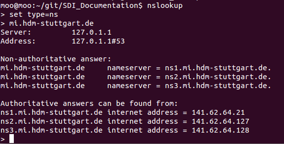
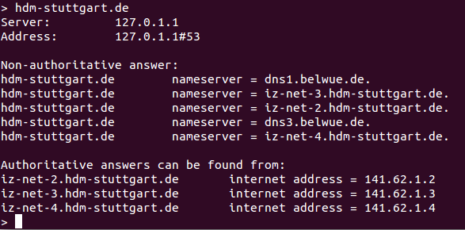

***
DNS
***

DNS Einführung
##############

Was ist DNS und was macht ``nslookup``?
***************************************

DNS (Domain Name Service) ist ein Netzwerkprotokoll, mit dem logische Netzadressen in physische und umgekehrt umgewandelt werden. Man spricht je nach Auflösungsrichtung von "lookup" oder "reverse lookup".

* Domainnamen <-> IP-Adressen
* Rechnernamen (in der gleichen Domäne) <-> IP-Adressen
* MX-Records
* Nameservice

Der Windows- und Linux-CLI-Command für DNS-lookups ist ``nslookup``. Optional können abhängig von der Auflösungsrichtung Domainnamen bzw. IP-Adressen angegeben werden, die aufgelöst werden sollen.

Falls die aufzulösende Maschine in der gleichen Domäne wie der Requestor liegt, kann mit ``nslookup <hostname>`` dieser direkt ohne Kenntnis über den FQDN (Fully Qualified Domain Name) aufgelöst werden. Wenn die Zielmaschine nicht in der gleichen Domäne liegt, erfolt der Lookup mit ``nslookup <hostname>.<domain>``.

Eigenheiten von ``nslookup``
++++++++++++++++++++++++++++
Folgende Befehle wurden ausgeführt:
::
		nslookup hdm-stuttgart.de	    	# geht nicht
		nslookup www.hdm-stuttgart.de		# geht
		nslookup mi.hdm-stuttgart.de		# geht

Offenbar existiert kein DNS-Eintrag für die Adresse ``hdm-stuttgart.de``, sondern nur für ``www.hdm-stuttgart.de``. Wenn wir diese Eigenheit mit dem Lookup von ``google.de`` und ``www.google.de`` vergleichen, gibt es für beide Google-Adressen DNS-Einträge (s.u.).

Warum braucht man DNS?
**********************
* IP Adressen können sich ändern. Ein referenzierender Domainname kann dagegen immer gleich bleiben.
* IP Adressen kann man sich schlecht merken, Domainnamen sind leichter eizunprägen.
* Für einen Domainname können mehrere IP-Adressen existieren (Ausfallsicherheit, Lastverteilung)

``nslookup`` im Detail
**********************
Mit ``nslookup`` allein startet man das Tool, über das sich DNS-Server genauer abfragen lassen.

*Eingabe*
::
		> nslookup
		>> set type=mx
		>> mi.hdm-stuttgart.de

*Ausgabe*
::
		mx1.mi.hdm-stuttgart.de
		mx2.mi.hdm-stuttgart.de
		mx3.mi.hdm-stuttgart.de
		mx4.mi.hdm-stuttgart.de
		mx5.mi.hdm-stuttgart.de

Wie in der Ausgabe zu sehen ist, hat der DNS-Server auf der Maschine ``mi.hdm-stuttgart.de`` fünf Mailserver eingetragen. In diesem Fall dient das zur Lastverteilung (und auch Ausfallsicherheit durch Redundanz). Der DNS-Server kann so konfiguriert werden, dass er die fünf hinterlegten Adressen unterschiedlich auslastet. So kann z.B. angegeben werden, dass ``mx1.mi.hdm-stuttgart.de`` 50% aller Anfragen (=~ Traffic) erhalten soll, da er der leistungsstärkste unter den fünf Servern ist.

*Eingabe*:
::
		> nslookup
		> server sdi1a.mi.hdm-stuttgart.de

*Erklärung:* Jetzt spricht man mit Eingaben direkt den DNS-Server auf ``sdi1a.mi.hdm-stuttgart.de`` an.

``nslookup`` ist bei vielen Distributionen, u.a. bei Ubuntu, im Standardumfang enthalten. Falls es jedoch nicht vorinstalliert ist, kann das Tool mit ``apt-get install dnsutils`` installiert werden.

Beispiel google.de
++++++++++++++++++

Bei der Eingabe von
::
		nslookup www.google.de

kommt ein Eintrag zurück. Bei der Eingabe von
::
		nslookup google.de

kommen jedoch mehrere Einträge zurück. Mit der ``rrset-order``-Einstellung im DNS-Server kann die Reihenfolge
der zurückgegebenen A- (IPv4) oder AAAAA-Einträge (IPv6) festgelegt werden, z.B. eine zufällige Reihenfolge. Diese hätte zur Folge,
dass die gelisteten IP-Adressen gleich stark ausgelastet werden (Ziel wieder: Lastverteilung und Ausfallsicherheit).

Beispiel ``hdm-stuttgart.de``
+++++++++++++++++++++++++++++
*Eingabe:*
::
		> set type=ns
		> mi.hdm-stuttgart.de

*Ausgabe:*
Die Ausgabe davon hat 3 Einträge zur Ausfallsicherheit.

*Eingabe:*
::
		> hdm-stuttgart.de

*Ausgabe:*

Die Ausgabe davon hat fünf Einträge. zwei davon intern, drei davon sind von BelWue, dem Forschungsnetzwerk, an das die HdM angeschlossen ist. Das hängt damit zusammen, dass BelWue verlangt, dass zwei DNS ausserhalb der Einrichtung liegen müssen. (*Quelle: Herr Goik*)

DNS Secure
**********
Die Domain Name System Security Extensions (DNSSEC) sind eine Reihe von Internetstandards, die DNS um Sicherheitsmechanismen zur Gewährleistung der Authentizität und Integrität der Daten erweitern. Ein DNS-Teilnehmer kann damit verifizieren, dass die erhaltenen DNS-Zonendaten auch tatsächlich identisch sind mit denen, die der Ersteller der Zone autorisiert hat. DNSSEC wurde als Mittel gegen Cache Poisoning entwickelt. Es sichert die Übertragung von Resource Records durch digitale Signaturen ab. Eine Authentifizierung von Servern oder Clients findet nicht statt.

*Quelle: http://de.wikipedia.org/wiki/Domain_Name_System_Security_Extensions*

DNS Zones
*********
Man braucht 2 Zonen, um einen einfachen DNS-Service einzurichten.

1. Forward-Zone: Rechnername -> IP-Adresse
2. Reverse-Zone: IP-Adresse -> Rechername

Bei der Administrierung von DNS-Services kann das umständlich sein, da für jeden Eintrag im semantischen Sinn jeweils zwei Zone-Einträge getätigt werden müssen. Durch Managing-Tools oder Hooks stehen haber Maßnahmen zur Verfügung, um diesen Prozess zu vereinfachen.

DNS Forwarding
**************
DNS-Server sind hierarchisch in einer Baumstruktur geordnet. Wenn ein "Leaf"-DNS, z.B. der DNS-Service den wir im Rahmen der Veranstaltung aufsetzen, eine Eingabe nicht auflösen kann, geht die Anfrage weiter an einen übergeordneten DNS. Je höher der DNS-Server in der Struktur liegt, desto wahrscheinlicher ist id.R., dass er die Domain bzw. die IP-Adresse auflösen kann. etwas nicht auflösen kann, geht die Anfrage weiter an übergeordnetes DNS, das evtl. mehr weiss.

DNS Logs
********
Logs sind default-mässig in ``/var/log``. Das ist der allgemeine Log-Ordner unter Linux, worunter viele Dienste ihre Logs ablegen. Im File ``syslog`` in diesem Verzeichnis werden u.a. DNS-Logs gespeichert, auch LDAP-Logs existieren vom Prozess ``slapd``.

Wenn Log-Files zu gross werden, können sie von einem eigenen Service umbenannt und seperat als Datei abgespeichert werden.

Mit ``tail`` lässt sich das Ende einer Datei in der Konsole ausgeben. Mit dem Parameter ``f``, also
::

		tail -f <dateiname>

kann eine Datei "live" getracked werden. Sobald in die Datei geschrieben wird, in unserem Fall also ``/var/log/syslog``, werden die letzten Änderungen im CLI ausgegeben.

Ein DNS-Log-Eintrag kann z.B. mit einem Neustart des DNS-Services erreicht werden. Ein Neustart kann mit
::

		service bind9 restart

initiiert werden.

Verbunden mit dem Tool ``grep`` kann die Ausgabe weiter eingeschränkt werden, z.B. mit:
::

		tail -f syslog | grep named | grep loaded

Sonstiges
*********

``hostname``
++++++++++++

Der Hostname eines Rechners kann mit ``hostname`` bestimmt werden.

``/etc/resolv.conf``
++++++++++++++++++++
Die Datei ``/etc/resolv.conf`` wird für die Namensauflösung nach DNS verwendet. ``nameserver`` ist die IP-Adresse eines DNS-Servers, der abgefragt werden soll. Bis zu drei Server werden in der Reihenfolge abgefragt in der sie aufgezählt sind. In folgendem Beispiel wird auf ``localhost`` und auf einen Google-DNS mit der IP-Adresse 8.8.8.8 verwiesen.
::
		nameserver 127.0.0.1
 		nameserver 8.8.8.8

``/etc/hosts``
++++++++++++++
In der Datei ``/etc/hosts`` können konkrete Hostname<->IP-Adressen -Assoziationen eingetragen werden. Obwohl
üblicherweise die Auflösung über DNS stattfindet, wird i.d.R. die Loopback-Adresse statisch in das File eingetragen:
::
		127.0.0.1 localhost

Exercises
#########

Setup des DNS-Servers
*********************

Mithilfe von apt-get wurden zunächst die benötigten Pakete auf
dem Server installiert:
::
    apt-get update
    apt-get install bind9 bind9utils

Anschließend wurde unter ``/etc/default/bind9`` die Option "-4"
hinzugefügt. Die OPTIONS-Variable sieht nun folgendermaßen aus:
::
    OPTIONS="-4 -u bind"

Der zusätzliche Eintrag versetzt BIND in den IPv4-Modus.

Als nächstes muss die Options-Datei von BIND bearbeitet werden. Diese befindet sich unter ``/etc/bind/named.conf.options``. Im Block *options* wurden die folgenden Einträge hinzugefügt:

.. code-block:: html
  :linenos:

  options {
        directory "/var/cache/bind";
        recursion yes;
        //allow-recursion { trusted; };
        listen-on { 141.62.75.101; };
        allow-transfer { none; };

				forwarders {
				};
  			...
  };

Anschließend müssen die Zonen unter  ``/etc/bind/named.conf.local`` definiert werden:

.. code-block:: html
  :linenos:

  # Forward Zone
  zone "mi.hdm-stuttgart.de" {
    type master;
    file "/etc/bind/zones/db.mi.hdm-stuttgart.de"; # zone file path
  };

  # Reverse Zone
  zone "75.62.141.in-addr.arpa" {
    type master;
    file "/etc/bind/zones/db.141.62.75"; # zone file path
  };

Der Name der Reverse-Zone bildet sich aus der umgekehrten Reihenfolge der IP-Oktetten, gefolgt von dem Zusatz ``.in-addr.arpa``. Für die Reverse-Zone für Adressen, die mit ``141.62.75.*`` beginnen, lautet der Name der Zone folglich ``75.62.141.in-addr.arpa``.

Nun müssen die jeweiligen Zone-Files (Forward- und Reverse-File) erstellt werden, in denen die einzelnen Auflösungen definiert sind.
Als Vorlage für die Zone-Files können die ``db.*``-Templatedateien aus dem ``/etc/bind/``-Verzeichnis verwendet werden.

Forward-Zone - ``/etc/bind/zones/db.mi.hdm-stuttgart.de``:

.. code-block:: html
  :linenos:

  ;
  ; BIND data file
  ;
  $TTL    604800
  @       IN      SOA     ns1a.mi.hdm-stuttgart.de. root.mi.hdm-stuttgart.de. ( ; (1)
                                3         ; Serial                              ; (2)
                           604800         ; Refresh
                            86400         ; Retry
                          2419200         ; Expire
                           604800 )       ; Negative Cache TTL
  ;

  ; name servers - NS records                                                   ; (3)
          IN      NS      ns1a.mi.hdm-stuttgart.de.

  ; name servers - A records                                                    ; (4)
  ns1a.mi.hdm-stuttgart.de.          IN      A       141.62.75.101
  www1a.mi.hdm-stuttgart.de.         IN      A       141.62.75.101

Erläuterungen zum Aufbau:

1. Ein SOA-Record (Start of Authority) definiert eine Domäne. ``ns1a.mi.hdm-stuttgart.de.`` kennzeichnet den primären (Master-) Nameserver und ``root.mi.hdm-stuttgart.de.`` die E-Mail-Adresse des Administrators - der erste Punkt ersetzt ein @-Symbol.
2. Die Serial dient der Dokumentation und sollte nach jeder Änderung der Datei inkrementiert werden.
3. Im NS records-Abschnitt sind alle Nameserver für diese Domain gelistet.
4. Im A records-Abschnitt sind die Hosts mit ihren IP-Adressen gelistet. Im Beispiel werden zwei Hostnamen auf die Adresse ``141.62.75.107`` gemappt: ``ns1a.mi.hdm-stuttgart.de`` und ``www1a.mi.hdm-stuttgart.de``.

Reverse-Zone - ``/etc/bind/zones/db.141.62.75``:

.. code-block:: html
  :linenos:

  ;
  ; BIND reverse data file
  ;
  $TTL    604800
  @       IN      SOA     ns1a.mi.hdm-stuttgart.de. root.mi.hdm-stuttgart.de. (
                                1         ; Serial
                           604800         ; Refresh
                            86400         ; Retry
                          2419200         ; Expire
                           604800 )       ; Negative Cache TTL
  ;

  ; name servers - NS records
        IN      NS      ns1a.mi.hdm-stuttgart.de.

  ; PTR Records
  101   IN      PTR     sdi1a.mi.hdm-stuttgart.de.

Rekursive Anfragen ermöglichen
******************************
Aktuell beantwortet der Nameserver lediglich Anfragen, die er selbstständig beantworten kann, also nur für Einträge, die in den jeweiligen Zone-Dateien definiert sind. Eine Anfrage an www.google.de würde beispielsweise keine Ergebnisse liefern. Der DNS kann so eingestellt werden, dass er Anfragen, die er nicht beantworten kann, automatisch an einen anderen Nameserver weitergibt. Falls der zweite Nameserver den Namen ebenfalls nicht auflösen kann, gibt dieser die Anfrage an einen weiteren Server weiter - vorausgesetzt, dass er entsprechend konfiguriert ist. Diesen Prozess nennt man eine rekursive Anfrage.

Rekursive Anfragen können in der Konfigurationsdatei ``/etc/bind/named.conf.options`` aktiviert werden:

.. code-block:: html
  :linenos:

  options {
	directory "/var/cache/bind";
	listen-on { 141.62.75.101; };
	allow-transfer { none; };

	recursion yes; // Rekursive Anfragen aktivieren
	allow-recursion { any; }; // Rekursive Anfragen von allen Hosts erlauben

	forwarders {
		141.62.64.21; // lokaler DNS
	};

	dnssec-enable yes; // Sicherheitseinstellungen
	dnssec-validation yes;

	auth-nxdomain no;
	listen-on-v6 { any; };
  };

Das Gegenstück zu rekursiven Anfragen sind iterative Anfragen, bei denen der Client Verweise zu einem anderen DNS-Server bekommt, den er als nächstes Abfragen soll (Im Fall, dass der angefragte DNS-Server keinen Eintrag zur Anfrage hat).

Mail Exchange Record einrichten
*******************************
Um die Namensauflösung für einen Mailserver einzurichten, muss die Forward-Zone um den entsprechenden Eintrag erweitert werden.

.. code-block:: none
  :linenos:
  :emphasize-lines: 16,17

  ;
  ; BIND data file
  ;
  $TTL    604800
  @       IN      SOA     ns1a.mi.hdm-stuttgart.de. dh055.hdm-stuttgart.de. (
                              3         ; Serial
                         604800         ; Refresh
                          86400         ; Retry
                        2419200         ; Expire
                         604800 )       ; Negative Cache TTL

  ; ...
  ; ... NS records and A records ...
  ; ...

  ; mail server - A record
  mx1.mi.hdm-stuttgart.de.        IN      A       141.62.64.21

Im Beispiel ist der Nameserver nun so konfiguriert, dass er Anfragen an ``mx1.mi.hdm-stuttgart.de`` an die Adresse ``141.62.64.21`` (= der Mailserver der HdM) weiterleitet.

Logging aktivieren
******************

Falls der DNS-Server nicht erwartungsgemäß funktioniert, oder man einfach
aufgetretene Fehler abspeichern möchte, so bietet ``bind9`` die Möglichkeit, Logging auf verschiedenen ``Loglevels`` zu  aktivieren.

Dazu muss der folgende Eintrag in ``named.conf.options`` hinzugefügt werden;

.. code-block:: html
  :linenos:

  logging{
      channel simple_log { // Channel wird definiert.
                           // Es können mehrere Channels definiert werden,
                           // um Lognachrichten von verschiedenen Levels in
                           // unterschiedlichen Dateien zu speichern.
              file "/var/log/bind.log" versions 3 size 5m; // Log wird in dieser Datei gespeichert.
              severity debug;  // Hier wird der Loglevel definiert.
              print-time yes;
              print-severity yes;
              print-category yes;
      };
      category default{
              simple_log;
      };
  };

Überprüfung der DNS-Konfiguration
*********************************
Zur Überprüfung der Konfiguration bietet BIND folgende Kommandozeilentools:

.. glossary::

  named-checkconf
    Überprüft alle ``named.conf*``-Dateien auf ihre Syntax. Falls keine Fehler gefunden wurden, kehrt das Tool kommentarlos auf die Konsole zurück.

  named-checkzone (1) (2)
  	Überprüft alle Zone-Dateien auf ihre Korrektheit. Parameter (1) verlangt den Namen der Zone und Parameter (2) die zugehörige Zone-Datei. Im Beispiel lauten die Befehle für die Forward-, bzw. Reverse-Zone ``named-checkzone mi.hdm-stuttgart.de /etc/bind/zones/db.mi.hdm-stuttgart.de`` bzw. ``named-checkzone 75.62.141.in-addr.arpa /etc/bind/zones/db.141.62.75``

Falls keine Fehler auftreten, kann der Server verwendet werden. Ein Host kann den Server nun als Standard-Nameserver festlegen, indem er ihn in seine ``/etc/resolv.conf`` aufnimmt:

.. code-block:: none

  nameserver 141.62.75.101
