****
LDAP
****

LDAP Einführung
###############

Allgemeines
***********

LDAP (Lighweight Directory Access Protocol) ist ein Protokoll mit dem über das Netzwerk auf spezielle Verzeichnisse zugegriffen werden kann. LDAP-Verzeichnisse zeichnen sich dadurch aus, dass sie sich automatisch replizieren- und über mehrere Systeme verteilen lassen. In LDAP-Verzeichnissen können Informationen verschiedenster Art gespeichert werden. Häufig sind die Informationen auf Benutzer innerhalb eines Unternehmens bezogen. Üblich sind beispielsweise Namen, Login-Daten und E-Mail-Adressen.

Daten dieser Art könnten ebenfalls in Datenbanken abgespeichert werden. Ein Vergleich zwischen Verzeichnissen und (relationalen) Datenbanken liegt also nahe. Der wohl größte Unterschied ist die Strukturierung der Daten. Bei Datenbanken sind einzelne Datensätze in Form von Tupeln in einer Vielzahl von Tabellen gespeichert, die sich untereinander referenzieren. Verzeichnisse sind baumartig, also hierarchisch, innerhalb eines **Directory Information Tree** (DIT) strukturiert. Dieser enthält eine Menge von **Objekten**, die wiederum in **Container** und **Blätter** unterteilt sind. Container können wiederum weitere Objekte, also Container und Blätter, enthalten. Die Container an den "Enden" sind üblicherweise die gespeicherten Personen. Diese enthalten eine Menge an Blättern, die die einzelnen Attribute der Person darstellen. Ein solches Attribut ist beispielsweise ein Name, eine E-Mail-Adresse oder Telefonnummer, etc. Jedes dieser Attribute hat einen Typ, der in einer **objectClass** definiert ist.
Die generelle Struktur des Baums ist in einem **Schema** definiert.

Die Objekte eines Baums werden über den sog. **Distinguished Name** (DN) referenziert. Dieser setzt sich aus einer Reihe **Relative Distinguished Names** (RDN) zusammen, welche folgendermaßen unterteilt werden können:

- **Domain Component** (dc): Die Identifikation des Unternehmens. Üblicherweise ist dieser an dessen Internetdomain angelehnt, wobei die Punkte entfernt werden und die einzelnen Domainbestandteile in eigene RDNs verpackt werden. Aus *beispiel.de* wird also *dc=beispiel,dc=de*
- **Organizational Unit** (ou): Definiert die einzelnen Organisationseinheiten (Abteilungen) innerhalb des Unternehmens
- **Common Name** (cn): Der Name über den eine Person referenziert wird.

RDNs werden bei der Zusammensetzung des DN mit einem Komma als Abstandhalter aneinandergeheftet. Ein Angestellter *Max Mustermann* des Unternehmens *Beispiel.de*, dem die Rolle *Project-Manager* in der Abteilung *Development* zugeteilt ist, könnte beispielsweise den DN 

::

  cn=mustermann,ou=pm,ou=dev,dc=beispiel,dc=de

haben.

.. topic:: Abkürzungen

  .. glossary::
    DIT
      Directory Information Tree
    DC
      Domain Component
    DN
      Distinguished Name
    RDN
      Relative Distinguished Name
    CN
      Common Name
    OU
      Organizational Unit

Apache Directory Studio
***********************

Das Apache Directory Studio (ADS) ist ein auf Eclipse basierendes Tool, mit dem CRUD-Operationen auf LDAP-Datenbanken
ausgeführt werden können. Es ist für Windows, Linux und Mac OS X verfügbar und kann `hier <https://directory.apache.org/studio/downloads.html>`_ heruntergeladen werden.

Das Apache Directory Studio vereinfacht den Installationsprozesses und eignet sich hervorragend, um LDAP-Verzeichnisse zu durchsuchen. Für Administrierungsaufgaben sind jedoch Web-basierte Tools, wie der LDAP Account Manager (s. u.) geeigneter.

Um sich im Directory Studio mit einem LDAP-Server zu verbinden, muss der im untenstehenden Screenshot mit **1.** markierte Button im Interface betätigt werden, woraufhin das rechtsstehende Dialogfenster erscheint. Hier können die Verbindungsdaten eingegeben werden. Der **Verbindungsname** dient zum Zweck der Anzeige innerhalb des Programms und kann frei gewählt werden. **Hostname** und **Port** entprechen der Adresse des LDAP Servers. In diesem Fall handelt es sich um den der HdM. Als **Verschlüsselungs-Methode** kann optional TLS eingestellt werden.

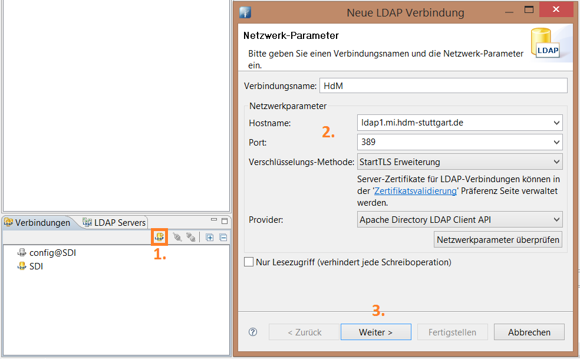

Mit einem Klick auf "Weiter" gelangt man auf die nächste Seite des Dialogfensters.

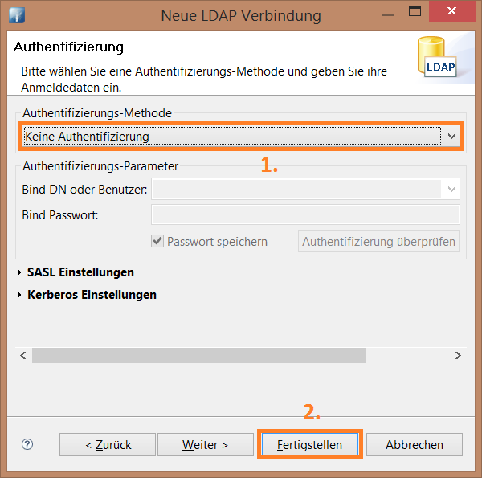

In diesem kann man sich authentifizieren. Im Fall des HdM-LDAP-Servers kann der Zugriff auch anonym erfolgen. Mit einem Klick auf "Fertigstellen" ist die Einrichtung abgeschlossen.

Exercises
#########

Einrichtung eines LDAP-Servers
******************************

Zunächst muss der Open-LDAP-Server über den Paketmanager installiert werden. Neben dem eigentlichen Server (``slapd``) sollten auch Utilitys zur Administration des Servers (``ldap-utils``) installiert werden.

::

  sudo apt-get install slapd ldap-utils

Während der Installation muss man Admin-Credentials festlegen, die für den ``rootDN`` der LDAP-Datenbank gesetzt werden. Standardmäßig heißt dieser bei uns ``cn=admin,dc=mi,dc=hdm-stuttgart,dc=de``.

Neben dem eigentlichen LDAP-Datenbank, in der später Daten gespeichert werden, wird ebenso eine ``config``-Datenbank erstellt (s.u.).

Die Installation erstellt eine lauffähige Konfiguration - darunter eine Datenbank, in der die LDAP-Daten gespeichert werden können.

Der ``baseDN`` dieser Instanz wird vom Domainnamen des ``localhost`` abgeleitet. Alternativ kann der Domainname für ``localhost`` in der Datei ``/etc/hosts`` manuell vergeben werden, sodass ein erwünschter ``baseDN`` erstellt werden kann. Die Standardkonfiguration in unseren VMs ist daher

::

  dc=mi,dc=hdm-stuttgart,dc=de

Mit dem Apache Directory Studio kann nun wie oben beschrieben auf diesen eben eingerichteten LDAP-Server zugegriffen werden.

Die ``config``-Datenbank
++++++++++++++++++++++++

Der Inhalt der Config-Datenbank sieht aus wie folgt:

.. code-block:: html
  :linenos:

  /etc/ldap/slapd.d/
  /etc/ldap/slapd.d/cn=config
  /etc/ldap/slapd.d/cn=config/cn=module{0}.ldif
  /etc/ldap/slapd.d/cn=config/cn=schema
  /etc/ldap/slapd.d/cn=config/cn=schema/cn={0}core.ldif
  /etc/ldap/slapd.d/cn=config/cn=schema/cn={1}cosine.ldif
  /etc/ldap/slapd.d/cn=config/cn=schema/cn={2}nis.ldif
  /etc/ldap/slapd.d/cn=config/cn=schema/cn={3}inetorgperson.ldif
  /etc/ldap/slapd.d/cn=config/cn=schema.ldif
  /etc/ldap/slapd.d/cn=config/olcBackend={0}hdb.ldif
  /etc/ldap/slapd.d/cn=config/olcDatabase={0}config.ldif
  /etc/ldap/slapd.d/cn=config/olcDatabase={-1}frontend.ldif
  /etc/ldap/slapd.d/cn=config/olcDatabase={1}hdb.ldif
  /etc/ldap/slapd.d/cn=config.ldif

Direkte Änderungen in der ``config``-Datenbank sind nicht empfohlen, man soll vielmehr
über das LDAP-Protokoll (Tool aus dem Package ``ldap-utils``) Änderungen vornehmen.

LDIF Files
**********

LDIF (LDAP Data Interchange Format) ist ein Dateiformat zur Darstellung von Informationen aus einem LDAP-Verzeichnis. Mit LDIF-Dateien lassen sich Einträge zu einem LDAP-Verzeichnis hinzufügen, editieren und löschen.
Über ``slapadd`` im Terminal (LDAP-Server zur Sicherheit dafür stoppen) oder die
Importfunktion des Apache Directory Studios lassen sich LDIF-Files importieren.

Ein LDIF-File kann z.B. folgendermaßen aussehen:

.. code-block:: html
  :linenos:

  dn:dc=betrayer,dc=mi,dc=hdm-stuttgart,dc=de
  changetype: add
  objectclass: dcObject
  objectclass: organizationalUnit
  dc: betrayer
  ou: config
  ou: betrayer Dot com

  dn: ou=departments,dc=betrayer,dc=mi,dc=hdm-stuttgart,dc=de
  changetype: add
  objectClass: top
  objectClass: organizationalUnit
  ou: departments

  dn: ou=software,ou=departments,dc=betrayer,dc=mi,dc=hdm-stuttgart,dc=de
  changetype: add
  objectClass: top
  objectClass: organizationalUnit
  ou: software

  dn: ou=devel,ou=software,ou=departments,dc=betrayer,dc=mi,dc=hdm-stuttgart,dc=de
  changetype: add
  objectClass: top
  objectClass: organizationalUnit
  ou: devel

  dn: uid=beam,ou=devel,ou=software,ou=departments,dc=betrayer,dc=mi,dc=hdm-stuttgart,dc=de
  changetype: add
  objectClass: inetOrgPerson
  uid: beam
  cn: Jim Beam
  givenName: Jim
  sn: Beam
  mail: beam@betrayer.com

  dn: uid=halle,ou=devel,ou=software,ou=departments,dc=betrayer,dc=mi,dc=hdm-stuttgart,dc=de
  changetype: add
  objectClass: inetOrgPerson
  uid: halle
  cn: Hans Halle
  givenName: Hans
  sn: Halle
  mail: halle@betrayer.com

Mit diesem LDIF-File werden dem DIT mehrere Organizational Units hinzugefügt. In den letzten zwei Blöcken wurden zudem zwei User hinzugefügt. Der Verzeichnisbaum sieht daraufhin folgendermaßen aus:

::
  
  .
  └─ dc=betrayer,dc=mi,dc=hdm-stuttgart,dc=de
     └─ ou=departments
        └─ ou=software
           └─ ou=devel
              ├─ cn=beam
              └─ cn=halle

Eine weitere Organizational Unit "sales" kann mit folgendem LDIF-Snippet angelegt werden:

.. code-block:: html
  :linenos:

  dn: ou=sales,ou=departments,dc=betrayer,dc=mi,dc=hdm-stuttgart,dc=de
  changetype: add
  objectClass: top
  objectClass: organizationalUnit
  ou: sales

Dieser Fügt sich folgendermaßen in den Baum ein:

::

  .
  └─ dc=betrayer,dc=mi,dc=hdm-stuttgart,dc=de
     └─ ou=departments
        ├─ ou=software
        |  └─ ou=devel
        |     ├─ cn=beam
        |     └─ cn=halle
        └─ ou=sales

Für das Hinzufügen in das LDAP-Directory gibt es wie bei der Suche zwei Möglichkeiten: Über das Apache Directory Studio (GUI) oder über das CLI.

Die Importfunktion der GUI ist selbsterklärend, daher wird im Folgenden nur kurz auf den Konsolenbefehl eingegangen.

Der Befehl zum Hinzufügen der LDIF-Datei lautet folgendermaßen:

::

    ldapadd -x -W -c -D cn=admin,dc=mi,dc=hdm-stuttgart,dc=de -f data.ldif

Die LDIF-Datei wurde in diesem Beispiel unter dem Namen **data.ldif** abgespeichert

``ldapadd`` is folgendermaßen aufgebaut:
::

    [sudo] ldapadd -x -W -c -D <bindDN> -f <filename>
  

.. topic:: ``ldapadd``

  .. glossary::
    ``-x``
      Gibt an, dass eine "einfache Authentifizierung" an Stelle von SASL verwendet wird.

    ``-W``
      User wird bei *simple authentication* per Prompt nach einem Passwort gefragt. Alternativ muss die Authentifizierung im Kommando selbst stattfinden.
      

    ``-c``
      Fährt im Fall von Fehlern ohne Abbruch fort. Die Fehler werden nach Durchführung in einem Report zusammengefasst

    ``-D <bindDN>``
      Gibt den ``bindDN`` an, mit dem der Bind durchgeführt werden soll.

    ``-f <filename>``
      Gibt die LDIF-Datei an, mit der die Aktion durgeführt werden soll.

.. topic:: Hinweis

  Um die Datei ``data.ldif`` auf den Server zu übertragen, kann das Tool ``scp`` zur Hilfe gezogen werden. Mit dem Befehl
  
  ::
  
      scp ./data.ldif root@141.62.75.106:.
  
  wird die Datei ins Home-Verzeichnis des Users **root** auf dem Server unter der IP ``141.62.75.106`` kopiert.

LDAP mit Thunderbird
********************

Auf die LDAP-Daten kann nun mit einem Mail-Client zugegriffen werden, in unserem Fall dem Tool *Mozilla Thunderbird*. Dazu müssen LDAP-Einträge eine Mailadresse beinhalten.

Via *Tools->Address Book->New->LDAP Directory* kann ein neues LDAP-Directory hinzugefügt werden:

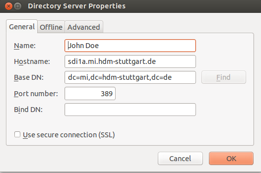

Es kann auch für die Offline-Nutzung heruntergeladen werden:

.. image:: images/offline.png

Nun können die User-Einträge mit dem Filter ``@`` angeschaut werden, sofern User zuvor entsprechend angelegt wurden:

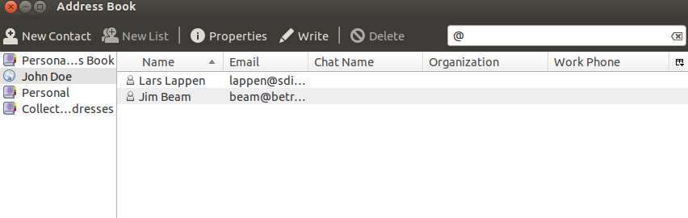

LDAP Suche mit Filtern
**********************

LDAP-Einträge können entweder per GUI über das Directory Studio oder per Kommandozeilentool ``ldapsearch`` aufgefunden werden.

Suche per Apache Directory Studio
+++++++++++++++++++++++++++++++++

Um einen Eintrag per GUI zu finden muss die Filterfunktion bemüht werden. In diesem Beispiel ist die UID des gesuchten Benutzers bekannt. Es soll nach dem Benutzer mit der UID **dh055** gesucht werden. Hierfür wird der Zweig, in dem sich der Benutzer befindet, rechts geklickt werden und im Kontextmenü der Eintrag **Kind-Einträge filtern...** ausgewählt werden.

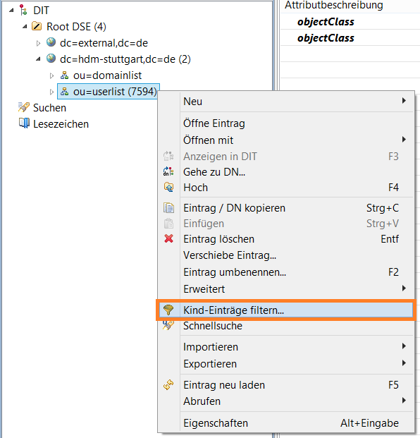

In der erscheinenden Maske wird die Abfrage formuliert. In diesem Fall lautet diese **(uid=dh055)**. Abfragen werden in einer speziellen LDAP-Syntax erstellt. Mehr dazu `hier <http://www.ldapexplorer.com/en/manual/109010000-ldap-filter-syntax.htm>`_.

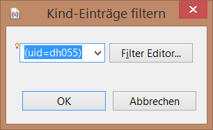

Nach der Bestätigung durch **OK** wird der gesuchte Eintrag auf der Oberfläche angezeigt.

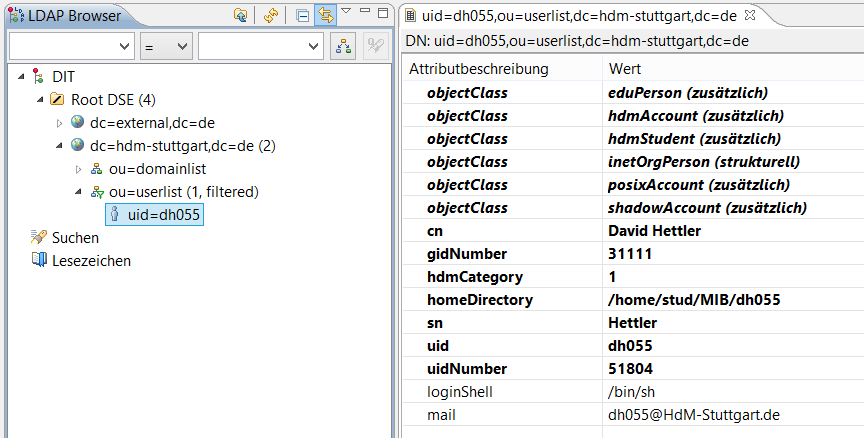

.. topic:: Hinweis

  Standardmäßig werden im Directory Studio nur 1000 Einträge angezeigt. Bei Verzeichnissen, die mehr Einträge enthalten, muss der Wert entsprechend angehoben werden. Dazu muss der betroffene Zweig im LDAP Browser rechts geklickt werden -> *Eigenschaften* -> *Verbindung* -> Reiter *Browser Optionen* -> *Max. Anzahl*. Der gewünschte Wert kann dort eingegeben werden.

Um die Filtersyntax näher zu beleuchten, hier ein paar
Beispiele:

.. topic:: Beispiele zu LDAP Suchfiltern

  .. glossary::
    ``(objectClass=*)``
      default Search Filter. Lässt alle objectClasses zu.

    ``(uid=*b*)``
      Jeder uid-Eintrag, der ein "b" enthält.

    ``(cn=b*)``
      Jeder uid-Eintrag, der mit einem "b" beginnt.

    ``(&(objectClass=user)(email=abc*))``
      Jeder Eintrag mit ``objectClass=user`` UND einer E-Mail-Adresse, die
      mit "abc" beginnt.

Allgemein: die Search-Syntax unterstützt Operatoren (!, &, |, =, ~=, <=, >=) und
Wildcards (*). Gruppierungen erfolgen durch Einklammern. Falls nach reservierten
Sonderzeichen gesucht werden muss (Klammern, !, ^, ...), lassen sich diese im
Suchstring escapen.

Suche per ``ldapsearch``
++++++++++++++++++++++++

Ebenso kann der Eintrag mit dem Tool **ldapsearch** gefunden werden. Dieses befindet sich im Paket **ldap-utilities**.
Der Befehl zur Suche des Benutzers **dh055** lautet 

::

    ldapsearch -x -W -b "ou=userlist,dc=hdm-stuttgart,dc=de" -p 389 -h "ldap1.mi.hdm-stuttgart.de" uid=dh055

Die Konsole zeigt das Ergebnis daraufhin folgendermaßen an:

::

  # extended LDIF
  #
  # LDAPv3
  # base <ou=userlist,dc=hdm-stuttgart,dc=de> with scope subtree
  # filter: uid=dh055
  # requesting: ALL
  #
  
  # dh055, userlist, hdm-stuttgart.de
  dn: uid=dh055,ou=userlist,dc=hdm-stuttgart,dc=de
  hdmCategory: 1
  sn: Hettler
  loginShell: /bin/sh
  uidNumber: 51804
  gidNumber: 31111
  mail: dh055@HdM-Stuttgart.de
  uid: dh055
  objectClass: hdmAccount
  objectClass: hdmStudent
  objectClass: inetOrgPerson
  objectClass: posixAccount
  objectClass: shadowAccount
  objectClass: eduPerson
  cn: David Hettler
  homeDirectory: /home/stud/MIB/dh055
  
  # search result
  search: 2
  result: 0 Success
  
  # numResponses: 2
  # numEntries: 1

Der Befehl wird folgendermaßen zusammengesetzt:
::

  [sudo] ldapsearch -Q -LLL -Y <mechanismus> -H <URIs> -b <searchbase> dn

Der Befehl kann entweder ohne Authentifizierung (Parameter ``-x``) oder mit "Simple Authenticationand Security Layer" (SASL) (``-Y`` <SASL mechanism>) ausgeführt werden:

::

  [sudo] ldapsearch -x -LLL -H <URIs> -b <searchbase> dn

.. topic:: ``ldapsearch``

  .. glossary::
    ``-Q``
      Nutzt den SASL "quiet mode". User wird nicht nach Eingaben gefragt.

    ``-LLL``
      Begrenzt die Ausgabe auf LDIFv1, versteckt Kommentare, deaktiviert das Ausgeben der LDIF-Version (jedes "L" grenzt die Ausgabe weiter ein)

    ``-Y <mechanismus>``
      Spezifiziert den Authentifizierungsmechanismus. Übliche Angaben sind ``DIGEST-MD5``, ``KERBEROS_V4`` und ``EXTERNAL``. Wir verwenden ``EXTERNAL``, das eine Authentifizierung über einen Sicherheitsmechanismus einer niedrigeren OSI-Schicht (wie z.B. TLS) ermöglicht.

    ``-h <URIs>``
      Aufgelistete URIs geben die Adresse von ein oder mehreren LDAP-Servern an. Der Standard ist ``ldap:///``, was bedeutet, dass das Protokoll LDAP über TCP verwendet wird. ``ldapi:///`` nutzt auch LDAP, was aber anstatt TCP den UNIX-domain Socket IPC verwendet

    ``-b <searchbase>``
      Spezifiziert eine sog. "Searchbase" als Startpunkt für die Suche. In unserem Fall ``cn=config`.

    ``-x``
      Gibt an, dass eine "einfache Authentifizierung" an Stelle von SASL verwendet wird.

    ``-W``
      User wird bei *simple authentication* per Prompt nach einem Passwort gefragt. Alternativ muss die Authentifizierung im Kommando selbst stattfinden.

    ``<filter>``
      Bietet die Möglichkeit, einen Ausgabefilter anzugeben. Falls er weggelassen wird, wird der Standardfilter ``(objectClass=*)`` verwendet. Wir verwenden ``dn``, sodass alle "distinguished names" innerhalb der Searchbase (s.o.) angezeigt werden.

Such-Filter Aufgaben
++++++++++++++++++++

Der Filter ``(uid=b*)`` filtert Einträge, für welche ein Attribut ``uid`` existiert und das mit dem Buchstaben "d" beginnt.

Der Filter ``(|(uid=*)(ou=d*))`` begrenzt die Ausgabe auf Einträge, die entweder ein definiertes ``uid``-Attribut oder ein ``ou``-Attribut mit dem Anfangsbuchstaben "d" besitzen.

Einträge erweitern
******************
Zuletzt fügten wir ein ``posixAccount`` für den User "Jim Beam" mithilfe dem folgenden ldif-File hinzu:

.. code-block:: html
  :linenos:

  dn: uid=beam,ou=devel,ou=software,ou=departments,dc=betrayer,dc=mi,dc=hdm-stuttgart,dc=de
  changetype: modify
  add: objectClass
  objectClass: posixAccount
  -
  add: uidNumber
  uidNumber: 610
  -
  add: gidNumber
  gidNumber: 610
  -
  add: homeDirectory
  homeDirectory: /home/beam/

Die Objektklasse ``posixAccount`` erfordert die Angabe einer ``uidNumber`` und einer ``gidNumber``.

Über den Befehl ``ldapmodify`` lassen sich die Änderungen unter Angabe der LDIF-Datei einspielen:

::

  ldapmodify -x -W -D "cn=admin,dc=betrayer,dc=mi,dc=hdm-stuttgart,dc=de" -f datamodified.ldif

Die Syntax ist nahezu deckungsgleich mit der von ``ldapadd``, daher gehen wir nicht genauer darauf ein.

LDAP Account Manager
********************
Der LDAP Account Manager (LAM) stellt Funktionen zur Administration von LDAP-Verzeichnissen über ein Webinterface zur Verfügung.
LAM kann über die Kommandozeile mit dem Befehl

::

  [sudo] apt-get install ldap-account-manager

installiert werden.

Der LAM läuft auf Apache und ist nach der Installation sofort unter
``http://localhost/lam`` erreichbar. Über das Interface, das unter dieser Adresse zu finden ist,
lassen sich sogleich die LAM-Einstellungen vornehmen. Das standardmäßige Master-Passwort
lautet ``lam``.

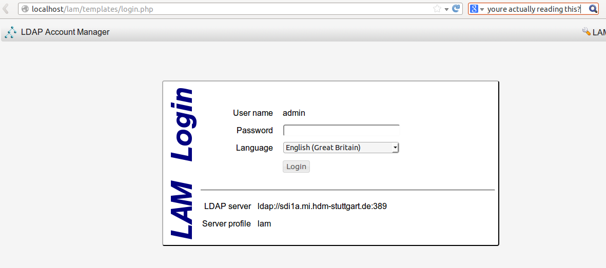

Der Reiter *General Settings* umfasst Einstellungen zur Sicherheit, Passwörtern und
deren Policies, sowie Logging.

Damit auf den installierten LDAP-Server zugegriffen werden kann, müssen unter Server-Profiles die Daten des Servers eingestellt werden.

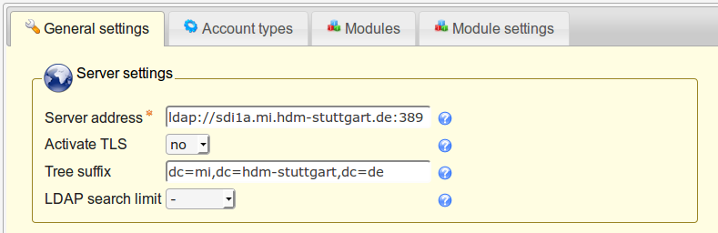

Zudem müssen die richtigen Security-Settings eingestellt werden:

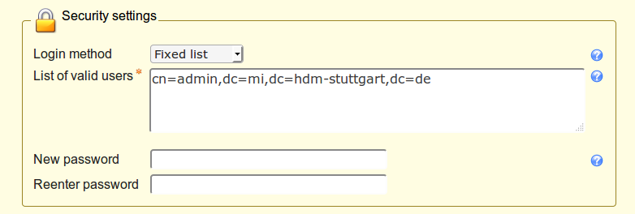

Auch unter dem Reiter *Account Types* müssen für User, Hosts und Groups die entsprechenden LDAP-Suffixes angegeben werden:

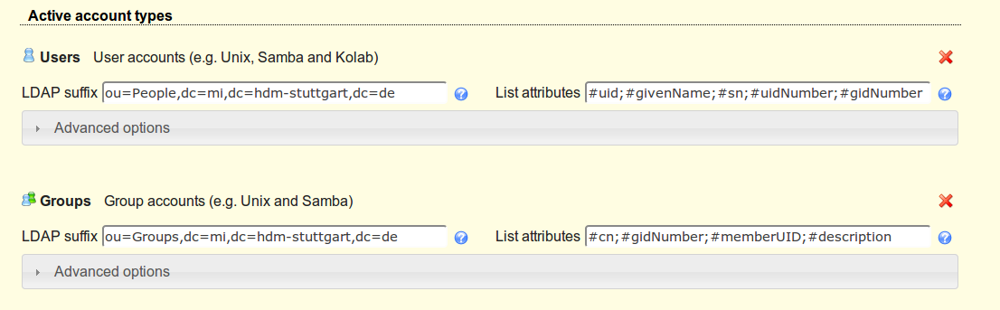

Ferner können unter dem Reiter **Modules** die ``objectClass`` der LDAP-Entitätstypen verwaltet werden:

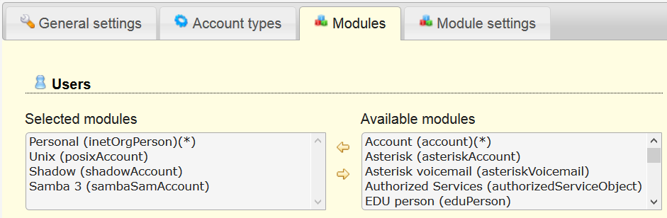

Unter dem Reiter **Module Settings** lassen sich zudem Einstellungen zu den UIDs für Users, Groups
und Hosts vornehmen. Also z.B. die Art des UID-Generators oder der Wertebereich, in dem sich
generierte UIDs befinden dürfen.

Nach dem Ausführen dieser Schritte ist der LAM fertig konfiguriert und die Anmeldung auf dem LDAP-Server is möglich.

Die eingetragenen Benutzer werden nun unter dem Reiter **Users** korrekt angezeigt und können bearbeitet werden:

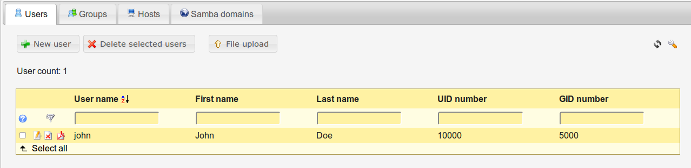

LDAP Replikation (Theorie)
**************************
LDAP-Replikation dient zur Ausfallsicherheit. Mithilfe von Replikation können LDAP-Services weiterhin verfügbar sein, auch wenn eine LDAP-Instanz in der LDAP-Infrastruktur versagt hat.

Die Umgebung der HdM enthält einen LDAP-Master sowie einige LDAP-Slaves, wie z.B. ``ldap1.mi``. Je nach Konfiguration, können Änderungen bidirektional oder vom Master an alle Slaves übertragen werden (single source).

Userrechte werden über LDIF-Files für jede LDAP-Instanz einer Replikationsumgebung inkludiert.
