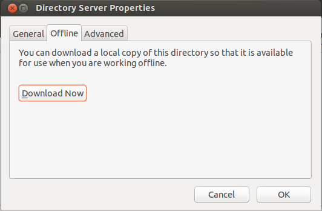

****
LDAP
****

The LDAP concept
################

SOMETHING AMNOG THOSE LINES:

- schemas (also built-ins like cosine, nis, inetorgperson)
- tree structure

-  A LDAP directory is a tree of data entries that is hierarchical in nature and is called the Directory Information Tree (DIT).
- An entry consists of a set of attributes.
- An attribute has a type (a name/description) and one or more values.
- Every attribute must be defined in at least one objectClass.
- Attributes and objectclasses are defined in schemas (an objectclass is actually considered as a special kind of attribute).
- Each entry has a unique identifier: its Distinguished Name (DN or dn). This, in turn, consists of a Relative Distinguished Name (RDN) followed by the parent entry's DN.
- The entry's DN is not an attribute. It is not considered part of the entry itself.
- The terms object, container, and node have certain connotations but they all essentially mean the same thing as entry, the technically correct term.
- For example, below we have a single entry consisting of 11 attributes where the following is true:
- DN is "cn=John Doe,dc=example,dc=com"
- RDN is "cn=John Doe"
- parent DN is "dc=example,dc=com"

.. topic:: Abkürzungen

  .. glossary::
    DIT
      Directory Information Tree
    DC
      Domain Component
    DN
      Distinguished Name
    RDN
      Relative Distinguished Name
    CN
      Common Name
    OU
      Organizational Unit

Apache Directory Studio
#######################

Das Apache Directory Studio (ADS) ist ein auf Eclipse basierendes Tool, mit dem CRUD-Operations auf LDAP-Datenbanken
ausgeführt werden können.

Dient zur Unterstützung des Installationsprozesses, sowie der Entwicklung und dem Debugging unter LDAP.
Für die alltäglichen Administrierungsaufgaben sind jedoch webbasierte Tools geeigneter.

Setting up a LDAP-Server
########################

Man unterscheidet zwischen dem *OpenLDAP server daemon* im Package ``slapd`` und *LDAP
management utilities* im Package ``ldap-utils``.

::

  sudo apt-get install slapd ldap-utils

Während der Installation muss man Admin-Credentials festlegen, die für den
``rootDN`` der LDAP-Datenbank gesetzt werden, standardmäßig ist das

::

  cn=admin,dc=mi,dc=hdm-stuttgart,dc=de

Neben der eigentlichen LDAP-Datenbank, in der später Daten gespeichert werden, wird
eine ``config``-Datenbank erstellt (s.u.).

Die Installation erstellt eine lauffähige Konfiguration, darunter eine Datenbank
in der die LDAP-Daten gespeichert werden können.

Der "base DN" (DN = Distinguished Name) dieser Instanz wird vom Domainnamen des
``localhost`` abgeleitet. Alternativ kann man die Datei ``/etc/hosts`` editieren, um manuell
Domainnamen für localhost vergeben, sodass ein erwünschter ``baseDN`` erstellt
werden kann. Die Standardkonfiguration in unseren VMs ist daher

::

  dc=mi,dc=hdm-stuttgart,dc=de

Die ``config``-Datenbank
************************

Der Inhalt der config-Datenbank sieht aus wie folgt:

.. code-block:: html
  :linenos:

  /etc/ldap/slapd.d/
  /etc/ldap/slapd.d/cn=config
  /etc/ldap/slapd.d/cn=config/cn=module{0}.ldif
  /etc/ldap/slapd.d/cn=config/cn=schema
  /etc/ldap/slapd.d/cn=config/cn=schema/cn={0}core.ldif
  /etc/ldap/slapd.d/cn=config/cn=schema/cn={1}cosine.ldif
  /etc/ldap/slapd.d/cn=config/cn=schema/cn={2}nis.ldif
  /etc/ldap/slapd.d/cn=config/cn=schema/cn={3}inetorgperson.ldif
  /etc/ldap/slapd.d/cn=config/cn=schema.ldif
  /etc/ldap/slapd.d/cn=config/olcBackend={0}hdb.ldif
  /etc/ldap/slapd.d/cn=config/olcDatabase={0}config.ldif
  /etc/ldap/slapd.d/cn=config/olcDatabase={-1}frontend.ldif
  /etc/ldap/slapd.d/cn=config/olcDatabase={1}hdb.ldif
  /etc/ldap/slapd.d/cn=config.ldif

Direkte Änderungen in der ``config``-Datenbank sind nicht empfohlen, man soll vielmehr
über das LDAP-Protokoll (Tool aus dem Package ``ldap-utils``) Änderungen vornehmen.

The LDAP-Protocol
#################
Befehl ``ldapsearch``:
::

  [sudo] ldapsearch -Q -LLL -Y EXTERNAL -H ldapi:/// -b cn=config dn

Variation davon:
::

  [sudo] ldapsearch -x -LLL -H ldap:/// -b dc=example,dc=com dn

Entweder ohne Authentifizierung (Parameter ``-x``) oder mit "Simple Authentication
and Security Layer" (SASL) (-Y <SASL mechanism>).

.. topic:: ``ldapsearch``

  .. glossary::
    ``-Q``
      Nutzt den SASL "quiet mode". User wird nicht nach Eingaben gefragt.

    ``-LLL``
      Begrenzt die Ausgabe auf LDIFv1, versteckt Kommentare, deaktiviert das Ausgeben der LDIF-Version (jedes "L" grenzt die Ausgabe weiter ein)

    ``-Y <mechanismus>``
      Spezifiziert den Authentifizierungsmechanismus. Übliche Angaben sind ``DIGEST-MD5``, ``KERBEROS_V4`` und ``EXTERNAL``. Wir verwenden ``EXTERNAL``, das eine Authentifizierung über einen Sicherheitsmechanismus einer niedrigeren OSI-Schicht (wie z.B. TLS) ermöglicht.

    ``-h <URIs>``
      Aufgelistete URIs geben die Adresse von ein oder mehreren LDAP-Servern an. Der Standard ist ``ldap:///``, was bedeutet, dass das Protkoll LDAP über TCP verwendet wird. ``ldapi:///`` nutzt auch LDAP, was aber anstatt TCP den UNIX-domain Socket IPC verwendet

    ``-b <searchbase>``
      Spezifiziert eine sog. "Searchbase" als Startpunkt für die Suche. In unserem Fall ``cn=config`.

    ``-x``
      Gibt an, dass eine "einfache Authentifizierung" an Stelle von SASL verwendet wird.

    ``<filter>``
      Bietet die Möglichkeit, einen Ausgabefilter anzugeben. Falls er weggelassen wird, wird der Standardfilter ``(objectClass=*)`` verwendet. Wir verwenden ``dn``, sodass alle "distinguished names" innerhalb der Searchbase (s.o.) angezeigt werden.

LDIF Files
##########

Mit LDIF Files lassen sich LDAP-spezifische Daten speichern, z.B. als Export-Funktion.
Über ``slapadd`` im Terminal (LDAP-Server zur Sicherheit dafür stoppen) oder die
Importfunktion des Apache Directory Studios lassen sich LDIF-Files importieren.

Ein LDIF-File kann z.B. folgendermaßen aussehen:

.. code-block:: html
  :linenos:

  dn:dc=betrayer,dc=mi,dc=hdm-stuttgart,dc=de
  changetype: add
  objectclass: dcObject
  objectclass: organizationalUnit
  dc: betrayer
  ou: config
  ou: betrayer Dot com

  dn: ou=departments,dc=betrayer,dc=mi,dc=hdm-stuttgart,dc=de
  changetype: add
  objectClass: top
  objectClass: organizationalUnit
  ou: departments

  dn: ou=software,ou=departments,dc=betrayer,dc=mi,dc=hdm-stuttgart,dc=de
  changetype: add
  objectClass: top
  objectClass: organizationalUnit
  ou: software

  dn: ou=devel,ou=software,ou=departments,dc=betrayer,dc=mi,dc=hdm-stuttgart,dc=de
  changetype: add
  objectClass: top
  objectClass: organizationalUnit
  ou: devel

  dn: uid=beam,ou=devel,ou=software,ou=departments,dc=betrayer,dc=mi,dc=hdm-stuttgart,dc=de
  changetype: add
  objectClass: inetOrgPerson
  uid: beam
  cn: Jim Beam
  givenName: Jim
  sn: Beam
  mail: beam@betrayer.com

  dn: uid=lappen,ou=devel,ou=software,ou=departments,dc=betrayer,dc=mi,dc=hdm-stuttgart,dc=de
  changetype: add
  objectClass: inetOrgPerson
  uid: lappen
  cn: Lars Lappen
  givenName: Lars
  sn: Lappen
  mail: lappen@sdi1a.mi.hdm-stuttgart.de

Ein weiter "Leaf"-User wurde im letzten Block hinzugefügt.

LDAP with mail client Thunderbird
#################################
Auf die LDAP-Daten kann nun mit einem Mail-client zugegriffen werden, in unserem Fall dem Tool *Mozilla Thunderbird*.

Via *Tools->Address Book->New->LDAP Directory* kann ein neues LDAP-Directory hinzugefügt werden:

.. image:: images/addressbooksettings.png

Es kann auch für die Offline-Nutzung heruntergeladen werden:

Nun können die Mails mit dem Filter ``@`` angeschaut werden:

.. image:: images/addressbook.png

LDAP Filter Search
##################

Filter kann man über das CLI oder über das Apache Directory Studio festlegen.

Die ``ldapsearch``-Syntax ist oben aufgeführt.

Im Apache Directory Studio stellt man Fliter ein, indem man auf den zu filternden
Knoten rechtsklickt und "Filter Children" auswählt. Im Popup-Fenster lässts sich
dann ein Suchstring eingeben. Um die Syntax näher zu beleuchten, hier ein paar
Beispiele:

.. topic:: Beispiele zu LDAP Search Filtern

  .. glossary::
    ``(objectClass=*)``
      default Search Filter. Lässt alle objectClasses zu.

    ``(uid=*b*)``
      Jeder uid-Eintrag, der ein "b" enthält.

    ``(cn=b*)``
      Jeder uid-Eintrag, der mit einem "b" beginnt.

    ``(&(objectClass=user)(email=abc*))``
      Jeder Eintrag mit ``objectClass=user`` UND einer E-Mail-Adresse, die
      mit "abc" beginnt.

Allgemein: die Search-Syntax uenterstützt Operatoren (!, &, |, =, ~=, <=, >=) und
Wildcards (*). Gruppierungen erfolgen durch Einklammern. Falls nach reservierten
Sonderzeichen gesucht werden muss (Klammern, !, ^, ...), lassen sich diese im
Suchstring escapen.

Search Filter Aufgaben
**********************
Der Filter ``(uid=b*)`` filtert User, bei denen ein Attribut mit "d" beginnt.

Der Filter ``(|(uid=*)(ou=d*))`` begrenzt die Ausgabe auf Einträge, die entweder ein definiertes ``uid``-Attribut oder ein ``ou``-Attribut mit dem Anfangsbuchstaben "d" besitzen.

Extending an existing Entry
###########################
Zuletzt fügten wir ein ``posixAccount`` für den User "Jim Beam" mithilfe dem folgenden ldif-File hinzu:

.. code-block:: html
  :linenos:

  dn: uid=beam,ou=devel,ou=software,ou=departments,dc=betrayer,dc=mi,dc=hdm-stuttgart,dc=de
  changetype: modify
  add: objectClass
  objectClass: posixAccount
  -
  add: uidNumber
  uidNumber: 600
  -
  add: gidNumber
  gidNumber: 600
  -
  add: homeDirectory
  homeDirectory: /home/beam/

LDAP Account Manager (LAM)
##########################
Installation unter Ubuntu mit
::

    [sudo] apt-get install ldap-account-manager

Der LAM läuft auf Apache und ist nach der Installation sofort unter
``http://localhost/lam`` erreichbar. Auf dieser Webseite
lassen sich gleich die LAM-Einstellungen vornehmen. Das default Master-Passwort
ist ``lam``.

.. image:: images/LAM/lamlogin.png

Die "General Settings" umfassen Einstellungen zur Sicherheit, Passwörtern und
deren Policies, sowie Logging.

Damit wir auf unseren LDAP- Server zugreifen können, müssen unter Server-Profiles die Daten unseren Servers eingestellt werden.

.. image:: images/LAM/ServerSetting.png

Außerdem müssen die richtigen Security-Settings eingestellt werden:

.. image:: images/LAM/SecuritySettings.png

Nun können wir uns auf unserem LDAP-Server korrekt anmelden.

Auch unter "Account Types" müssen für User, Hosts und Groups die entsprechenden
LDAP-Suffixes angegeben werden:

.. image:: images/LAM/AccountSettings.png

Mit diesen Einstellungen werden im Server die User korrekt angezeigt:

.. image:: images/LAM/UserList.png

Unter "Modules" können die "objectClass"es der LDAP-Entitätstypen verwaltet
werden.

Unter "Module Settings" lassen sich u.a. Einstellungen zu den UIDs für Users, Groups
und Hosts vornehmen. Also z.B. die Art des UID-Generators, sowie die Range, in der sich
generierte UIDs befinden dürfen.

LDAP Replication (basic theory)
###############################
LDAP-Replikation dient zur Absicherung für Fehler. Mitfhilfe von Replikation können LDAP-Services weiterhin verfügbar sein, auch wenn eine LDAP-Instanz in der LDAP-Infrastruktur versagt hat.

Die Umgebung der HdM enthält einen LDAP-Master sowie einige LDAP-Slaves, wie z.B. ``ldap1.mi``. Je nach Konfiguration, können Änderungen bidirektional oder vom Master an alle Slaves übertragen werden (single source).

Userrechte werden über LDIF-Files für jede LDAP-Instanz einer Replikationsumgebung inkludiert.
