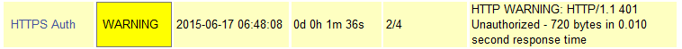

******
Nagios
******

Nagios Introduction
###################

Was ist Nagios
**************

Nagios ist eine Software, mit deren Hilfe Hosts in einer Infrastruktur überwacht werden können.

Nagios hat eine Sammlung von Modulen, mit deren spezielle Dienste eines Hosts überwacht werden können, zB. DNS, LDAP, etc...

Außerdem verfügt Nagios über einen Web-Schnittstelle mit der die gesammeltenabgefragt werden können.

Überwachung mittels NRPE
************************

Zur Überwachung von internen Eigenschaften von Remote-Hosts müssen die nötigen Plug-ins direkt auf dem Host ausgeführt werden.
Mittels NRPE ist es möglich, Plugins zur Überwachung interner Eigenschaften auf dem Remote-Hosts auszuführen.

Soll zum Beispiel der verfügbare Speicherplatz auf einem entfernten Rechner überprüft werden, wird das Plugin check_nrpe (Client) auf dem Nagios-Rechner ausgeführt.
check_nrpe sendet nun einen String an den zu überwachenden Rechner.
Der dort (auf Port 5666) hörende NRPE-Dienst (Server) vergleicht den ankommenden String mit den in seiner Konfigurationsdatei hinterlegten.
Jedem dieser Strings ist ein Kommando zugeordnet. Findet er den vomNagios Gesendeten in seiner Konfiguration, führt er das zugehörige Kommando aus und schickt das Ergebnis (Exitcode und Ausgabe) an check_nrpe der Nagiosmaschine zurück. 
check_nrpe wiederum reicht das Ergebnis an Nagios weiter, wo es, wie die Ergebnisse anderer Plugins auch dargestellt wird.

Quelle: http://wiki.monitoring-portal.org/nagios/howtos/nrpe

Exercises
#########
In diesem Beispiel wird ein Nagios Server aufgesetzt, der einen Remote Host überwacht. Die Überwachung des remote Hosts erfolgt mittels NRPE. 
Das *überwachende* System, auf dem Nagios läuft, hat den Hostnamen **sdi2a**. Die Adresse lautet ``141.62.75.2``.
Das *überwachte* System, also der Remote Host, hat den Hostnamen **sdi2b** und hat die Adresse ``141.62.75.2``.

Die Voraussetzungen für das überwachende System sind

1. ein funktionsfähiger Webserver
2. ein funktionsfähiger Mailserver

Falls diese Kriterien nicht gegeben sind, können die jeweiligen Programme mit den Befehlen ``apt-get install apache2`` (für den Webserver) und ``apt-get install posix`` (für den Mailserver) installiert werden.

Einrichtung des Nagios Servers
*******************************
Der Nagios Server wird mit dem Befehl ``apt-get install nagios3 nagios-nrpe-plugin`` auf dem überwachenden System installiert. ``nagios-nrpe-plugin`` ist das Plugin mit dem später der NRPE Daemon auf dem remote Host angesprochen wird.
Das Installationsskript fordert einen während der Installation zur Einstellung einiger Konfigurationswerte auf. Zunächst müssen die Mail-Einstellungen getroffen werden:

:: 

  Please select the mail server configuration type that best meets your needs.
    No configuration:
      Should be chosen to leave the current configuration unchanged.
    Internet site:
      Mail is sent and received directly using SMTP.
    Internet with smarthost:
      Mail is received directly using SMTP or by running a utility such as fetchmail. 
      Outgoing mail is sent using a smarthost.
    Satellite system:
      All mail is sent to another machine, called a 'smarthost', for delivery.
    Local only:
      The only delivered mail is the mail for local users. There is no network.
      
  1. No configuration  3. Internet with smarthost  5. Local only
  2. Internet Site     4. Satellite system

  General type of mail configuration: 2

In diesem Fall war Option **2. Internet Site** zutreffend.
Anschließend muss der FQDN der Mail-Adressen angegeben werden, an die Mails gesendet werden.

::

  The "mail name" is the domain name used to "qualify" _ALL_ mail addresses without a
  domain name. This includes mail to and from <root>: please do not make your machine
  send out mail from root@example.org unless root@example.org has told you to.
  
  This name will also be used by other programs. It should be the single, fully qualified
  domain name (FQDN).
  
  Thus, if a mail address on the local host is foo@example.org, the correct value for
  this option would be example.org.
  
  System mail name: hdm-stuttgart.de
  
Hier wurde **hdm-stuttgart.de** gewählt, da die Mails später an ``dh055@hdm-stuttgart`` gesendet werden sollen.
Anschließnd muss noch ein Passwort für den Nagios-Admin eingegeben werden:

::

  Please provide the password to be created with the "nagiosadmin" user.
  
  This is the username and password you will use to log in to your nagios installation
  after configuration is complete.  If you do not provide a password, you will have to
  configure access to nagios yourself.
  
  Nagios web administration password:

Nach der Eingabe des Passworts ist die initale Konfiguration des Nagios Servers abgeschlossen.
Das Admin-Passwort kann auch nachträglich mit dem Befehl ``htpasswd /etc/nagios3/htpasswd.users nagiosadmin`` geändert werden.

Über die URL sdi2a.mi.hdm-stuttgart.de/nagios3 kann nun auf das Nagios-Webinterface zugegriffen werden. Beim ersten Aufruf wird man zur Eingabe der Logindaten aufgefordert. Der Benutzername lautet **nagiosadmin** (sofern dies nicht geändert wurde) und das Passwort ist dsa Passwort, das in der eben durgeführten Konfiguration eingegeben wurde.

Überwachung eines Services auf eienm remote Host
************************************************
In Nagios müssen alle Services, die überwacht werden sollen, explizit in einer Konfigurationsdatei definiert werden. Hierfür wird auf dem überwachenden System die Datei ``/etc/nagios3/conf.d/sdi2b.conf`` angelegt. In dieser muss zunächst der überwachte Host definiert werden:

::

    define host{
      use       generic-host
      host_name   sdi2b
      alias     sdi2b
      address     141.62.75.107
    }

Außerdem soll der Festplattenspeicher auf sdi2b überwacht werden. Hierfür wird die ``sdi2b.conf`` um folgende Servicedefinition erweitert:

::

    define service{
      use           generic-service
      host_name       sdi2b
      service_description   HTTP Server
      check_command     check_http
    }

* **host_name**: Der Name des überwachten Hosts. Es ist der gleiche wie der in der Hostdefinition (weiter oben) angegebene **host_name**

* **check_command**: Das auszuführende Überwachungsprogramm gefolgt von den mit ``!`` getrennten Argumenten (in diesem Fall ohne Argumente). Die verfügbaren Programme befinden sich im Verzeichnis ``/usr/lib/nagios/plugins``. Hinweise zur Benutzung der Programme können abgerufen werden, indem das jeweilige Programm mit dem Argument ``-h`` aufgerufen wird.

Eine Auflistung aller verfügbarer Paramter befindet sich auf: http://nagios.sourceforge.net/docs/nagioscore/3/en/objectdefinitions.html#service

Die Konfiguration kann anschließend mit dem Befehl ``nagios3 -v /etc/nagios3/nagios.cfg`` überprüft werden.
Sollten keine Fehler aufgetreten sein, muss der Server neu gestart werden: ``service nagios3 restart``

Das Webinterface zeigt nun beide Hosts an. Der überwachende Rechner wird ebenfalls angezeigt, da Nagios standardmäßig eine Kofigurationsdatei für den eigenen Host mitliefert (``/etc/nagios3/conf.d/localhost_nagios2.cfg``).

Navigiert man auf die Serviceübersichtsseite vom sdi2b, wird auch der korrekte Status der Festplatte angezeigt:

E-Mail-Benachrichtigungen einrichten
************************************
Um E-Mail Benachrichtigungen zu aktivieren muss zunächst sichergestellt sein, dass der installierte Mailserver Mails an die angegebenen E-Mail-Adressen senden kann. In unserem Fall war dieses Kriterium nicht gegeben, sodass folgende Einstellungen in der ``/etc/postfix/main.cf`` gemacht werden mussten:
Die Zeile 

::

  mydestination = hdm-stuttgart.de, sdi2a.mi.hdm-stuttgart.de, localhost.mi.hdm-stuttgart.de, localhost
  
wurde mit 

::

    mydestination =
    
ersetzt und die Zeile

::

    strict_rfc821_envelopes = yes
    
eingefügt.

Sobald der Mailserver Mails senden kann, kann die eigentliche Einstellung zum Versenden von Mails in Nagios getroffen werden.
Dazu muss ein Kontakt, sowie eine Kontaktgruppe in der Datei ``/etc/nagios3/conf.d/contacts_nagios2.cfg`` angelegt werden:

::

    define contact{
        contact_name                    root
        contactgroups         admins
        alias               Root
        service_notification_period     24x7
        host_notification_period        24x7
        service_notification_options    w,u,c,r
        host_notification_options       d,r
        service_notification_commands   notify-service-by-email
        host_notification_commands      notify-host-by-email
        email                           dh055@hdm-stuttgart.de
    }

* **service_notification_options**: wann Mails gesendet werden sollen... w = warning, u = unknown, c = critical, r = recovery (Nachricht, sobald der Service wieder läuft)
Die weiteren Parameter sind weitestgehend selbsterklärend. Eine volle Auflistung dieser befindet sich auf http://nagios.sourceforge.net/docs/nagioscore/3/en/objectdefinitions.html#contact

Die Kontaktgruppe:

::

    define contactgroup{
            contactgroup_name       admins
            alias           Nagios Administrators
            members                 root
    }
    

.. topic:: Tip

    Zum Testen kann es hilfreich sein, die Zeit zwischen Serverausfall und der gesendeten Benachrichtigung zu verringern. Diese beträgt in den Standardeinstellungen nämlich einige Minuten. Die Einstellung kann pro Service in seiner Konfigurationsdatei getroffen werden oder global in der Definition des generic Service (``/etc/nagios3/conf.d/generic-service_nagios2.cfg``). Der Parameter lautet ``first_notification_delay 1``. Der darauffolgende Wert gibt die Zeit an, die gewartet wird, bevor die erste Nachricht gesendet wird. Die Zeiteinheit kann in ``/etc/nagios3/`` mit dem Parameter ``interval_length=5`` verändert werden, wobei der angegebene Wert den Sekunden entspricht. In diesem Fall ist ein Intervall also 5 Sekunden lang. Zusammen mit der Einstellung ``first_notification_delay 1`` bedeutet dies, dass 5 Sekunden gewartet wird, bevor die erste Statusnachricht gesendet wird.

Anschließend muss der Server neu gestartet werden: ``service nagios3 restart``

Wird der laufende Webserver auf dem remote host gestoppt, spiegelt sich die Änderung sogleich auf der Weboberfläche wider:

und Nagios sendet die Mail:

.. topic:: Tip

    Zum Testen kann es hilfreich sein, die sog. **Flap-Detection** entweder global- oder für einzelne Services zu deaktivieren.  Mit Flap-Detection können häufige Statusschwankungen erkannt werden. Ändert sich der Status eines Statuses zu oft, werden die Benachrichtigungen für den Service temporär deaktiviert. Dies kann in der Praxis hilfreich sein, um unnötige Spamnachrichten bei einer Fehlkonfiguration zu vermeiden. Da beim Testen Fehler provoziert werden sollen, ist dieser Schutzmechanismus für unsere Zwecke eher nachteilig. Um Flap Detection zu deaktivieren, muss der Parameter ``flap_detection_enabled    0`` in die betreffende Servicekonfiguration eingefügt werden, bzw. der Wert von ``1`` auf ``0`` geändert werden, falls der Parameter schon vorhanden war. Soll Flap-Detection standardmäßig deaktiviert werden, muss diese Einstellung in ``/etc/nagios3/conf.d/generic-service_nagios2.cfg`` vorgenommen werden.

Einrichtung des NRPE Servers
*****************************
Auf dem überwachten System wird der NRPE Server mit dem Befehl ``apt-get install nagios-nrpe-server`` installiert.
Standardmäßig ist der Aufruf von Nagios-Plugins auf dem Remote System aus Sicherheitsgründen nur ohne Argumente erlaubt. Um Argumente zu aktivieren, muss in der Konfigurationsdatei ``/etc/nagios/nrpe.cfg`` die Option ``dont_blame_nrpe=1`` gesetzt werden. Zustäzlich muss der Zugriff des überwachenden Systems explizit gestattet werden. Dies wird durch die Option ``allowed_hosts=141.62.75.102`` erreicht.

Ebenfalls in dieser Datei sind die Befehle definiert, wie sie vom überwachenden System aufgerufen werden. Standardmäßig sind nur Befehle ohne Argumente definiert:

::

  command[check_users]=/usr/lib/nagios/plugins/check_users -w 5 -c 10
  command[check_load]=/usr/lib/nagios/plugins/check_load -w 15,10,5 -c 30,25,20
  command[check_hda1]=/usr/lib/nagios/plugins/check_disk -w 20% -c 10% -p /dev/hda1
  command[check_zombie_procs]=/usr/lib/nagios/plugins/check_procs -w 5 -c 10 -s Z
  command[check_total_procs]=/usr/lib/nagios/plugins/check_procs -w 150 -c 200

Da wir Befehle mit Argumenten aufrufen wollen, werden diese Einträge nicht gebraucht und können auskommentiert werden. 
Eine Befehlsdefinition für einen Befehl mit Argumenten sieht ähnlich aus. Der Unterschied ist, dass an die Stelle der hartcodierten Werte Argument-Platzhalter stehen. Die Befehle zur Überwachung der Benutzer, Auslastung, Plattenspeicher und Prozesse sehen beispielsweise folgendermaßen aus.

::

  command[check_users]=/usr/lib/nagios/plugins/check_users -w $ARG1$ -c $ARG2$
  command[check_load]=/usr/lib/nagios/plugins/check_load -w $ARG1$ -c $ARG2$
  command[check_disk]=/usr/lib/nagios/plugins/check_disk -w $ARG1$ -c $ARG2$
  command[check_procs]=/usr/lib/nagios/plugins/check_procs -w $ARG1$ -c $ARG2$
  
Der Service muss nun neu gestartet werden: ``service nagios-nrpe-server restart``

Auf der Seite des überwachenden Systems müssen zur Überwachung dieser Dienste folgende Einträge in die Datei ``/etc/nagios3/conf.d/sdi2b.cfg`` eingefügt werden:

Benutzer:

::

  define service{
    use                             generic-service
    host_name                       sdi2b
    service_description             Disk Space
    check_command                   check_nrpe!check_users!20 50
  }

Prozessorauslastung:

::

  define service{
    use                             generic-service
    host_name                       sdi2b
    service_description             Current Load
    check_command                   check_nrpe!check_load!5.0,4.0,3.0 10.0,6.0,4.0
  }

Festplattenspeicher:

::

  define service{
    use                             generic-service
    host_name                       sdi2b
    service_description             Disk Space
    check_command                   check_nrpe!check_disk!20% 10%
  }
  
Anzahl der Prozesse:

::

  define service{
    use                             generic-service
    host_name                       sdi2b
    service_description             Total Processes
    check_command                   check_nrpe!check_procs!250 400
  }
  
An die Stelle der eigentlichen Überwachungsbefehle tritt der vorgestellte Befehl **check_nrpe**. Damit dieser zur Verfügung steht, muss das entsprechende Plugin mit dem Befehl ``apt-get install nagios-nrpe-plugin`` installiert werden. Zu beachten ist hier, dass die einzelnen Argumente NICHT, wie bei der normalen Überwachung ohne NRPE, mit einem "**!**" getrennt sind, sondern mit einem Leerzeichen.
Nach einem Neustart des Servers mit ``service nagios3 restart`` zeigt die Übersichtsseite nun die per NRPE überwachten Services an.

Überwachung der HTTPS Authentifizierung
***************************************
HTTPS Authentifizierung lässt sich mit dem Programm ``check_http --ssl -I [IP] -a [username:password]`` überwachen. Da der Befehl die Kenntnis über die Credentials von mindestens einem authorisierten Benutzer auf dem remote Host voraussetzt, bietet sich hier die Überwachung per NRPE an. Zusätzlich will man die Credentials evtl nicht über das Netzwerk schicken. Die Idee ist, auf dem überwachten System einen Befehl ohne Argumente zur Verfügung zustellen, welcher von dem überwachenden System aufgerufen wird. Die Credentials sind in der Definition des Befehls auf der überwachten Seite angegeben. Somit muss die überwachende Seite keine Credentials wissen und übers Netzwerk schicken.

Auf der überwachten Seite wird der Befehl in der Datei ``/etc/nagios/nrpe.cfg`` folgenermaßen definiert:

::

  command[check_http_auth]=/usr/lib/nagios/plugins/check_http --ssl -I localhost -a beam:password

Die Credentials sind in diesem Fall die des Beispielbenutzers **beam**. Sein Passwort ist **password**.
Anschließend wird der Daemon neu gestartet: ``service nagios-nrpe-server restart``.

Auf dem Nagios-Server auf der überwachenden Seite wird der Befehl in ``/etc/nagios3/conf.d/sdi2b.cfg`` aufgerufen:

::

  define service{
    use                             generic-service
    host_name                       sdi2b
    service_description             HTTPS Auth
    check_command                   check_nrpe_1arg!check_http_auth
  }
  
``check_nrpe_1arg`` ruft einen Befehl auf dem remote nur mit dem nachfolgenden Befehl auf, also ohne zusätzliche Argumente.

Nach einem Neustart des Services (``service nagios3 restart``) erscheint der überwachte Service auf dem Webinterface:

Um zu überprüfen, ob der Test funktioniert, ändern wir das Passwort zu einem falschen Passwort, sodass die Authentifizierung fehlschlägt:

::

  command[check_http_auth]=/usr/lib/nagios/plugins/check_http --ssl -I localhost -a beam:bad_credentials
  
Nach einem Neustart zeigt die Weboberfläche die Änderung korrekt an:

Überwachung des LDAP-Servers
****************************
Analog zum vorherigen Abschnitt kann der LDAP-Server auf dem remote Host überwacht werden.
Zunächst wird der Befehl ``check_ldap`` auf der NRPE-Seite in ``/etc/nagios/nrpe.cfg`` definiert:

::

  command[check_ldap]=/usr/lib/nagios/plugins/check_ldap -H localhost -b dc=betrayer,dc=com -3
  
Mit dem Argument ``-b [base-dn]`` gibt man den Basis-DN des DIT an. In diesem Fall lautet dieser **dc=betrayer,dc=com**. Mit dem Argument ``-3`` wird angegeben, dass es sich um einen LDAP-Server nach der LDAP-Protokollversion **3** handelt.

Der NRPE-Server muss nun neu gestartet werden: ``service nagios-nrpe-server restart``

Anschließend wird auf der überwachenden Seite die Servicedefinition zum Aufrufen des Befehls in die ``/etc/nagios3/conf.d/sdi2b.cfg`` aufgenommen:

::

  define service{
    use                     generic-service
    host_name               sdi2b
    service_description     LDAP
    check_command           check_nrpe_1arg!check_ldap
  }
  
Nach einem Neustart des Nagios-Daemons (``service nagios3 restart``) erscheint der Service auf dem Webinterface:

Einrichten von Serviceabhängigkeiten
************************************
Oftmals bestehen logische Abhängigkeiten zwischen den überwachten Services. Der gerade eingerichtete **HTTPS Auth**-Service ist beispielsweise vom **LDAP**-Service abhängig, da die HTTPS-Authentifizierung über LDAP realisiert ist. Fällt der LDAP-Server aus, funktioniert folglich die Authentifizierung auf dem Webserver nicht mehr. Für den Fall, dass der LDAP-Server ausfällt, sendet der Nagios-Daemon standardmäßig eine Benachrichtigungsmail für den Ausfall des LDAP-Servers sowie für jeden Service, der aufgrund der Nichterreichbarkeit von LDAP ausfällt. In einem realen Szenario wären noch viel mehr Services von LDAP abhängig, als nur der Webserver. Die Folge ist eine Kaskade an Benachrichtigungsmails, die dem Administrator nichts bringen, da dieser bereits weiß, dass die abhängigen Services nicht funktionieren können.

Das Webinterface zeigt den Effekt, den das Ausschalten des LDAP-Servers hat:

Wie erwartet kommen zwei E-Mails:

Eine solche Abhängigkeit kann in unserer Konfigurationsdatei ``/etc/nagios3/conf.d/sdi2b.cfg`` mit folgendem Eintrag definiert werden:

::

  define servicedependency{
    host_name                       sdi2b
    service_description             LDAP
    dependent_host_name             sdi2b
    dependent_service_description   HTTPS Auth
    notification_failure_criteria   o,w,u,c
  }

Diese Definition sagt aus, dass der Service mit dem Bezeichner **HTTPS Auth**, der auf dem Host **sdi2b** läuft, vom Service **LDAP**, der ebenfalls auf **sdi2b** läuft, abhängig ist. ``notification_failure_criteria`` bestimmt, in welchen Fällen KEINE Benachrichtigungen gesendet werden sollen. Die Werte ``o,w,u,c`` geben an, dass keine Benachrichtigungen gesendet werden sollen, wenn sich der **Masterservice** in einer der Zustände **OK** (o), **Warning** (w), **Unknown** (u) oder **Critical** (c) befindet.

Wird der LDAP-Server nun gestoppt, wird nur eine Mail versendet:

