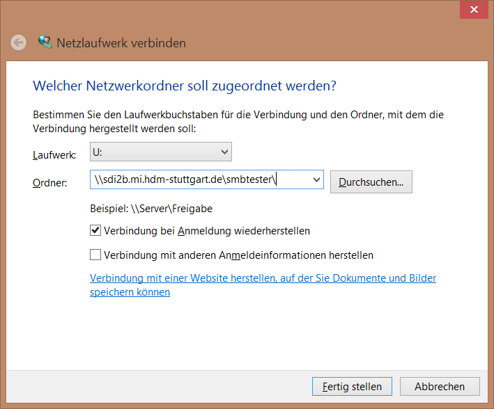
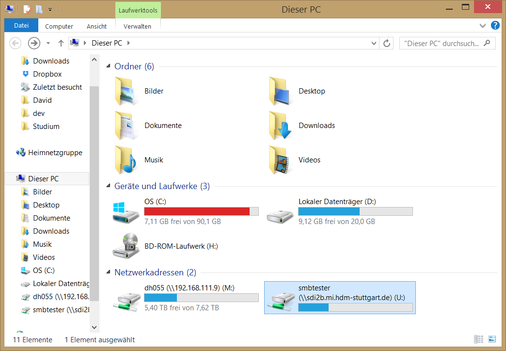

*****
Samba
*****

Samba Introduction
******************


Exercises
*********


Setup des Samba-Servers
#######################

Der Samba Server wird mit dem Befehl
::
  apt-get install samba

installiert.

Anschließend können Benutzer hinzugefügt werden. Dies geschieht mit dem Befehl ```smbpasswd -a %username%```.

Hierfür ist es notwendig, dass auf dem System Linux Benutzer mit dem entsprechenden Benutzernamen angelegt ist. Benutzer können mit dem Befehl ```useradd --create-home %username%``` angelegt werden. Mit dem Parameter ```--create-home``` wird gleichzeitig ein Homeverzeichnis angelegt.
::
  root@sdi2b:~# useradd --create-home smbtester

Zur Erstellung des Samba-Users:
::
  root@sdi2b:~# smbpasswd -a smbtester
  New SMB password:
  Retype new SMB password:
  Added user smbtester.

Auf die gleiche Weise wurde ein Samba-User für den root-User angelegt.

Samba user können nun mit dem Befehl ```pdbedit -L -v``` aufgelistet werden:
::
  root@sdi2b:~# pdbedit -L -v
  ---------------
  Unix username:        root
  NT username:
  Account Flags:        [U          ]
  User SID:             S-1-5-21-3735746035-584030464-2538432411-1000
  Primary Group SID:    S-1-5-21-3735746035-584030464-2538432411-513
  Full Name:            root
  Home Directory:       \\sdi2b\root
  HomeDir Drive:
  Logon Script:
  Profile Path:         \\sdi2b\root\profile
  Domain:               SDI2B
  Account desc:
  Workstations:
  Munged dial:
  Logon time:           0
  Logoff time:          Wed, 06 Feb 2036 15:06:39 UTC
  Kickoff time:         Wed, 06 Feb 2036 15:06:39 UTC
  Password last set:    Fri, 05 Jun 2015 08:43:24 UTC
  Password can change:  Fri, 05 Jun 2015 08:43:24 UTC
  Password must change: never
  Last bad password   : 0
  Bad password count  : 0
  Logon hours         : FFFFFFFFFFFFFFFFFFFFFFFFFFFFFFFFFFFFFFFFFF
  ---------------
  Unix username:        smbtester
  NT username:
  Account Flags:        [U          ]
  User SID:             S-1-5-21-3735746035-584030464-2538432411-1001
  Primary Group SID:    S-1-5-21-3735746035-584030464-2538432411-513
  Full Name:
  Home Directory:       \\sdi2b\smbtester
  HomeDir Drive:
  Logon Script:
  Profile Path:         \\sdi2b\smbtester\profile
  Domain:               SDI2B
  Account desc:
  Workstations:
  Munged dial:
  Logon time:           0
  Logoff time:          Wed, 06 Feb 2036 15:06:39 UTC
  Kickoff time:         Wed, 06 Feb 2036 15:06:39 UTC
  Password last set:    Fri, 05 Jun 2015 09:30:26 UTC
  Password can change:  Fri, 05 Jun 2015 09:30:26 UTC
  Password must change: never
  Last bad password   : 0
  Bad password count  : 0
  Logon hours         : FFFFFFFFFFFFFFFFFFFFFFFFFFFFFFFFFFFFFFFFFF


Freigabe von Ordnern
####################
Die Konfiguration zur Freigabe von Ordnern befindet sich in der Datei ```/etc/samba/smb.conf```.
Um beispielsweise das Verzeichnis ```/home/root/shared``` freizugeben, muss in der Konfigurationsdatei folgender Block hinzugefügt werden:
::
  [shared]
  path = /home/root/shared
  available = yes
  valid users = root
  read only = no
  browseable = yes
  public = yes
  writable = yes
  
Nach einem Serverneustart mit ```service smbd restart``` kann auf den Ordner über den Pfad ```\\sdi2b.mi.hdm-stuttgart.de\shared\``` zugegriffen werden.

Außerdem ist es möglich, alle Homedirectorys der Benutzer freizugeben. Hierfür muss in der ````smb.conf``` folgender Eintrag auskommentiert werden:
::
  [homes]
    comment = Home Directories
    browseable = no

Der User ```smbtester``` kann anschließend über den Pfad ```\\sdi2b.mi.hdm-stuttgart.de\smbtester\``` auf sein Homedirectory zugreifen.

Die Konfiguration kann mit dem Befehl ```testparm``` überprüft werden:
::
  root@sdi2b:~# testparm
  Load smb config files from /etc/samba/smb.conf
  rlimit_max: increasing rlimit_max (1024) to minimum Windows limit (16384)
  Processing section "[homes]"
  Processing section "[printers]"
  Processing section "[print$]"
  Processing section "[shared]"
  Loaded services file OK.
  Server role: ROLE_STANDALONE
  Press enter to see a dump of your service definitions

Informationen zu einzelnen Samba-Usern können mit ```smbclient``` abgerufen werden.
:: 
  root@sdi2b:~# smbclient -L localhost --user smbtester
  Enter smbtester's password:
  Domain=[WORKGROUP] OS=[Unix] Server=[Samba 4.1.6-Ubuntu]
  
          Sharename       Type      Comment
          ---------       ----      -------
          print$          Disk      Printer Drivers
          shared          Disk
          IPC$            IPC       IPC Service (sdi2b server (Samba, Ubuntu))
          smbtester       Disk      Home Directories
  Domain=[WORKGROUP] OS=[Unix] Server=[Samba 4.1.6-Ubuntu]
  
          Server               Comment
          ---------            -------
          SDI2B                sdi2b server (Samba, Ubuntu)
  
          Workgroup            Master
          ---------            -------
          WORKGROUP            SDI2B

Mounten von shares
##################

Windows
+++++++
Das Homedirectory des Users smbtester kann folgendermaßen in Windows eingebunden werden. 
Im Arbeitsplatz im Reiter "Computer" die Option "Netzwerkaufwerk verbinden" wählen.

.. image:: images/Samba/windows/01.png

Im erscheinenden Dialog den Laufwerkbuchstaben wähen und den Pfad eingeben und "Fertig stellen" klicken.



Der Ordner erscheint nun in Form eines Netzwerklauferks im Arbeitsplatz.




Linux
+++++


Verknüpfung mit einem LDAP-Server
#################################
