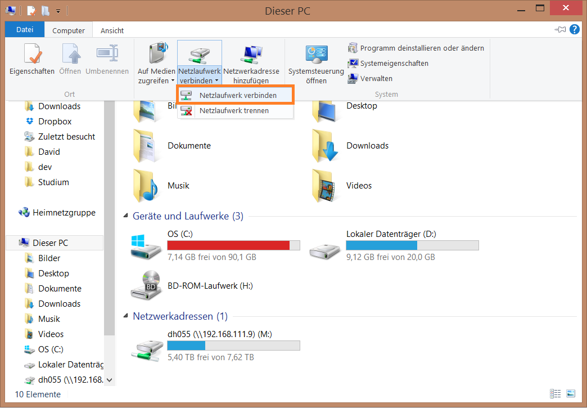
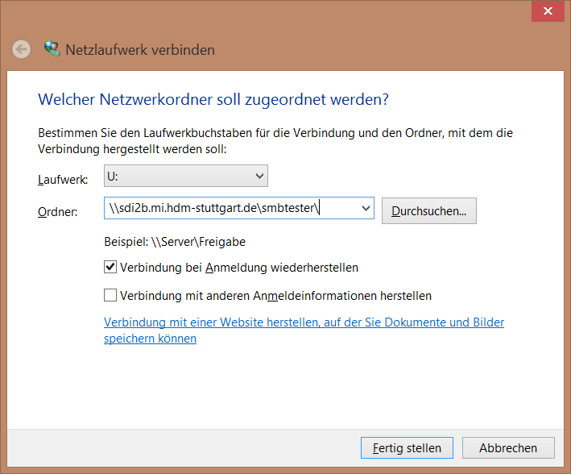
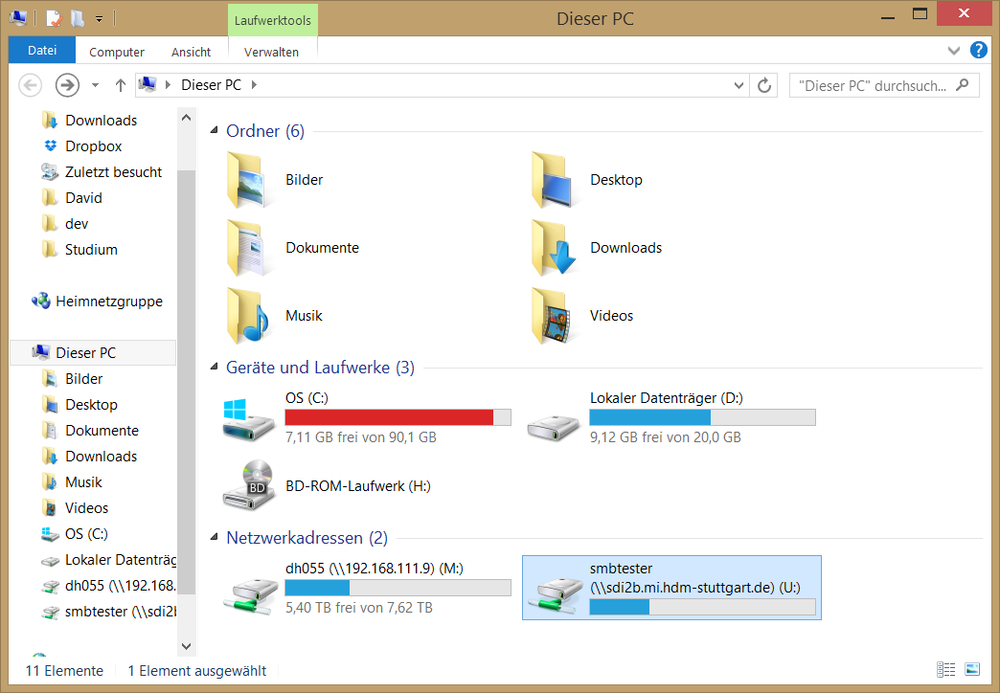

*****
Samba
*****

Samba Introduction
******************

Der Name Samba stammt vom Server Message Block-Protokoll (SMB).
Mithilfe von Samba können Daten (Verzeichnisse, Laufwerke, Festplatten) sowie Geräte (zb. Drucker) im Netzwerk geteilt werden.
Diese sogenannten Freigaben tauchen dann zB. in der Windows-Netzwerkumgebung auf und können eingebunden werden.
Unter Linux diese Freigaben ebenfalls gemountet werden.

Samba kann in gemischten Netzen (Windows & Linux) sowie homogenen Netzwerken zum Datenaustausch eingesetzt werden. 
Samba ist unter Linux sozusagen das Bindeglied zu anderen Betriebssystemen.

Die Bezeichnung "Samba-Server" bezeichnet den Rechner, der die Freigaben zur Verfügung stellt.
Der "Samba-Klient" ist der Rechner, welcher die Freigaben einbindet.
Ein Server kann mehrere Verzeichnisse für verschiedene Benutzer freigeben, so dass jeder Benutzer eine eigene Freigabe hat.
Falls nun ein Klient eine Freigabe einbinden will, so muss er sich zuerst gegenüber dem Server authentifizieren.
Exercises
*********


Setup des Samba-Servers
#######################

Der Samba Server wird mit dem Befehl
::
  apt-get install samba

installiert.

Anschließend können Benutzer hinzugefügt werden. Dies geschieht mit dem Befehl ```smbpasswd -a %username%```.

Hierfür ist es notwendig, dass auf dem System Linux Benutzer mit dem entsprechenden Benutzernamen angelegt ist. Benutzer können mit dem Befehl ```useradd --create-home %username%``` angelegt werden. Mit dem Parameter ```--create-home``` wird gleichzeitig ein Homeverzeichnis angelegt.
::
  root@sdi1a:~# useradd --create-home testuser0 

Zur Erstellung des Samba-Users:
::
  root@sdi1a:~# smbpasswd -a testuser0
  New SMB password:
  Retype new SMB password:
  Added user testuser0.

Auf die gleiche Weise wurden mehrere Samba-Benutzer für verschiedene Linux-User angelegt.

Samba user können nun mit dem Befehl ```pdbedit -L -v``` aufgelistet werden:
::
  root@sdi2b:~# pdbedit -L -v
  ---------------
  Unix username:        testuser0
  NT username:          testuser0
  Account Flags:        [U          ]
  User SID:             S-1-5-21-191455238-2906638316-4037938886-1003
  Primary Group SID:    S-1-5-21-191455238-2906638316-4037938886-1002
  Full Name:            testuser0
  Home Directory:       \\PDC-SRV\testuser0
  HomeDir Drive:        H:
  Logon Script:         logon.bat
  Profile Path:         \\PDC-SRV\profiles\testuser0
  Domain:               SDI1A
  Account desc:         
  Workstations:         
  Munged dial:          
  Logon time:           0
  Logoff time:          Tue, 19 Jan 2038 03:14:07 UTC
  Kickoff time:         Tue, 19 Jan 2038 03:14:07 UTC
  Password last set:    Tue, 23 Jun 2015 14:45:11 UTC
  Password can change:  Tue, 23 Jun 2015 14:45:11 UTC
  Password must change: never
  Last bad password   : 0
  Bad password count  : 0
  Logon hours         : FFFFFFFFFFFFFFFFFFFFFFFFFFFFFFFFFFFFFFFFFF
  ---------------
  Unix username:        testuser1
  NT username:          testuser1
  Account Flags:        [U          ]
  User SID:             S-1-5-21-191455238-2906638316-4037938886-1004
  Primary Group SID:    S-1-5-21-191455238-2906638316-4037938886-513
  Full Name:            testuser1
  Home Directory:       \\PDC-SRV\testuser1
  HomeDir Drive:        H:
  Logon Script:         logon.bat
  Profile Path:         \\PDC-SRV\profiles\testuser1
  Domain:               SDI1A
  Account desc:         
  Workstations:         
  Munged dial:          
  Logon time:           0
  Logoff time:          Tue, 19 Jan 2038 03:14:07 UTC
  Kickoff time:         Tue, 19 Jan 2038 03:14:07 UTC
  Password last set:    Tue, 23 Jun 2015 14:46:06 UTC
  Password can change:  Tue, 23 Jun 2015 14:46:06 UTC
  Password must change: never
  Last bad password   : 0
  Bad password count  : 0
  Logon hours         : FFFFFFFFFFFFFFFFFFFFFFFFFFFFFFFFFFFFFFFFFF


Freigabe von Ordnern
####################
Die Konfiguration zur Freigabe von Ordnern befindet sich in der Datei ```/etc/samba/smb.conf```.
Um beispielsweise das Verzeichnis ```/home/testuser0/shared``` freizugeben, muss in der Konfigurationsdatei folgender Block hinzugefügt werden:
::
  [testshare0]
  path = /home/testuser0/shared
  available = yes
  valid users = testuser0
  read only = no
  browseable = yes
  public = yes
  writable = yes
  
Nach einem Serverneustart mit ```service smbd restart``` kann auf den Ordner über den Pfad ```\\sdi1a.mi.hdm-stuttgart.de\testshare0\``` zugegriffen werden.

Außerdem ist es möglich, alle Homedirectorys der Benutzer freizugeben. Hierfür muss in der ````smb.conf``` folgender Eintrag auskommentiert werden:
::
  [homes]
    comment = Home Directories
    browseable = no

Der User ```testuser0``` kann anschließend über den Pfad ```\\sdi1a.mi.hdm-stuttgart.de\testuser0\``` auf sein Homedirectory zugreifen.

Die Konfiguration kann mit dem Befehl ```testparm``` überprüft werden:
::
  root@sdi1a:~# testparm
  Load smb config files from /etc/samba/smb.conf
  rlimit_max: increasing rlimit_max (1024) to minimum Windows limit (16384)
  Processing section "[homes]"
  Processing section "[printers]"
  Processing section "[print$]"
  Processing section "[shared]"
  Loaded services file OK.
  Server role: ROLE_STANDALONE
  Press enter to see a dump of your service definitions

Informationen zu einzelnen Samba-Usern können mit ```smbclient``` abgerufen werden.
::
  root@sdi1a:/home# smbclient -L localhost --user testuser0
  Enter testuser0's password: 
  Domain=[WORKGROUP] OS=[Unix] Server=[Samba 4.1.6-Ubuntu]
  
  	Sharename       Type      Comment
  	---------       ----      -------
	print$          Disk      Printer Drivers
	testshare0      Disk      
	testshare1      Disk      
	testshare2      Disk      
	IPC$            IPC       IPC Service (sdi1a server (Samba, Ubuntu))
  	testuser0       Disk      Home Directories
  Domain=[WORKGROUP] OS=[Unix] Server=[Samba 4.1.6-Ubuntu]

	Server               Comment
	---------            -------
	SDI1A                sdi1a server (Samba, Ubuntu)

	Workgroup            Master
	---------            -------
	WORKGROUP            SDI1A


Mounten von shares
##################

Windows
+++++++
Der freigegebene ```shared```-Ordner kann folgendermaßen in Windows eingebunden werden. 
Im Arbeitsplatz im Reiter "Computer" die Option "Netzwerkaufwerk verbinden" wählen.



Im erscheinenden Dialog den Laufwerkbuchstaben wähen und den Pfad eingeben und mit "Fertig stellen" bestätigen.



Der Ordner erscheint nun in Form eines Netzwerklauferks im Arbeitsplatz.




Linux
+++++

Mithilfe des mount-Kommandos kann das Dateisystem im Zielverzeichnis /mnt/test/ eingehängt werden:
::
  sudo mount -t cifs  //sdi1a.mi.hdm-stuttgart.de/testshare0 /mnt/test/ -ouser=testuser0

bzw zum Einhängen der Home-Directory von "testuser0":
::
  sudo mount -t cifs  //sdi1a.mi.hdm-stuttgart.de/testuser0 /mnt/test/ -ouser=testuser0

  
Verknüpfung mit einem LDAP-Server
#################################

Zunächst müssen diverse Packages installiert werden:
::
  sudo apt-get install samba samba-doc smbldap-tools


Samba LDAP Schema
+++++++++++++++++

Nun muss ein Samba LDAP Schema eingerichtet werden, so dass OpenLDAP als Backend von Samba  verwendet werden kann.

Der DIT braucht hierbei Attribute zum Beschreiben der Samba-Daten.
Diese Attribute sind im Samba LDAP Schema hinterlegt.

Entpacken des Schemas:
::
  sudo cp /usr/share/doc/samba-doc/examples/LDAP/samba.schema.gz /etc/ldap/schema
  sudo gzip -d /etc/ldap/schema/samba.schema.gz

Erstellen einer Datei "schema_convert.conf":
::
  include /etc/ldap/schema/core.schema
  include /etc/ldap/schema/collective.schema
  include /etc/ldap/schema/corba.schema
  include /etc/ldap/schema/cosine.schema
  include /etc/ldap/schema/duaconf.schema
  include /etc/ldap/schema/dyngroup.schema
  include /etc/ldap/schema/inetorgperson.schema
  include /etc/ldap/schema/java.schema
  include /etc/ldap/schema/misc.schema
  include /etc/ldap/schema/nis.schema
  include /etc/ldap/schema/openldap.schema
  include /etc/ldap/schema/ppolicy.schema
  include /etc/ldap/schema/ldapns.schema
  include /etc/ldap/schema/pmi.schema
  include /etc/ldap/schema/samba.schema

Erstellen einer Output-Directory:
::
  mkdir ldif_output

Ermitteln des korrekten Index:
::
  slapcat -f schema_convert.conf -F ldif_output -n 0 | grep samba,cn=schema

  dn: cn={14}samba,cn=schema,cn=config

Konvertieren des Schemas ins LDIF-Format:
::
  slapcat -f schema_convert.conf -F ldif_output -n0 -H \
  ldap:///cn={14}samba,cn=schema,cn=config -l cn=samba.ldif

Anschließend muss noch die Index- Information aus der generierten LDIF- Datei entfernt werden.

Am Ende der Datei müssen die Zeilen
::
  structuralObjectClass: olcSchemaConfig
  entryUUID: b53b75ca-083f-102d-9fff-2f64fd123c95
  creatorsName: cn=config
  createTimestamp: 20080827045234Z
  entryCSN: 20080827045234.341425Z#000000#000#000000
  modifiersName: cn=config
  modifyTimestamp: 20080827045234Z
ebenfalls gelöscht werden.

Das Schema kann nun zu LDAP-Server hinzugefügt werden:
::
  sudo ldapadd -Q -Y EXTERNAL -H ldapi:/// -f cn\=samba.ldif


Samba Indizes
+++++++++++++

OpenLDAP kennt nun Samba-Attribute, nun können noch Indizes für diese hinzugefügt werden, um die Performanz zu verbessern.

Eine neue Datei "samba_indices.ldif" wurde hierzu erstellt:
::
  dn: olcDatabase={1}hdb,cn=config
  changetype: modify
  add: olcDbIndex
  olcDbIndex: uidNumber eq
  olcDbIndex: gidNumber eq
  olcDbIndex: loginShell eq
  olcDbIndex: uid eq,pres,sub
  olcDbIndex: memberUid eq,pres,sub
  olcDbIndex: uniqueMember eq,pres
  olcDbIndex: sambaSID eq
  olcDbIndex: sambaPrimaryGroupSID eq
  olcDbIndex: sambaGroupType eq
  olcDbIndex: sambaSIDList eq
  olcDbIndex: sambaDomainName eq
  olcDbIndex: default sub


Die erstellten neuen Indizes können per
::
  sudo ldapmodify -Q -Y EXTERNAL -H ldapi:/// -f samba_indices.ldif
geladen werden.

Hinzufügen von Samba LDAP Objekten
++++++++++++++++++++++++++++++++++


Nun sollen die für Samba notwendigen Objekte in den DIT eingefügt werden.
Dies wird mithilfe des Packages "smbldap-tools" realisiert.

Zunächst wird ein Backup des aktuellen DIT erstellt, für den Fall dass etwas schief geht.
::
  slapcat -l backup.ldif

Anschließend werden die Objekte mithilfe des Kommandos 
::
  smbldap-populate
erzeugt.

Anmerkung:

Aufgrund eines Fehlers wurden die von smbldap-populate verwendeten Skripte nicht korrekt erzeugt.
Als Notlösung wurden uns diese von Hr. Goik zur Verfügung gestellt, mussten jedoch noch manuell konfiguriert werden:

In smbldap_bind.conf müssen die korrekten Credentials für den Root-Zugang des LDAP-Servers hinterlegt werden:
::
  masterDN="cn=admin,dc=mi,dc=hdm-stuttgart,dc=de"
  masterPw="test"
  slaveDN="cn=admin,dc=mi,dc=hdm-stuttgart,dc=de"
  slavePw="test"


In smbldap.conf müssen einiger Parameter angepasst werden:
::
  SID="S-1-5-21-191455238-2906638316-4037938886"	//Eigene SID einfügen
  ldapTLS="0" 						//Deaktivieren von TLS
  suffix="dc=mi,dc=hdm-stuttgart,dc=de"			//Korrekter LDAP-Suffix

Samba Konfiguration
+++++++++++++++++++

Nun muss lediglich Samba so konfiguriert werden, dass LDAP zur Authentifizierung verwendet wird.

Dazu werden in der Datei /etc/samba/smb.conf die folgenden Parameter eingefügt :
::
  passdb backend = ldapsam:ldap://sdi1a.mi.hdm-stuttgart.de
  ldap suffix = dc=mi,dc=hdm-stuttgart,dc=de
  ldap user suffix = ou=People
  ldap group suffix = ou=Groups
  ldap machine suffix = ou=Computers
  ldap idmap suffix = ou=Idmap
  ldap admin dn = cn=admin,dc=mi,dc=hdm-stuttgart,dc=de
  ldap passwd sync = yes
  ldap ssl = off      #WICHTIG, da wir TLS bei LDAP deaktiviert haben

Nun muss Samba neu gestartet werden:
::
  restart smbd
  restart nmbd

Samba benötigt noch das Passwort für den Root-DN:
::
  smbpasswd -w test


Nun erfolgt die Authentifizierung beim mounten wie in Kapitel 6.2.3
gezeigt mithilfe von LDAP! 
