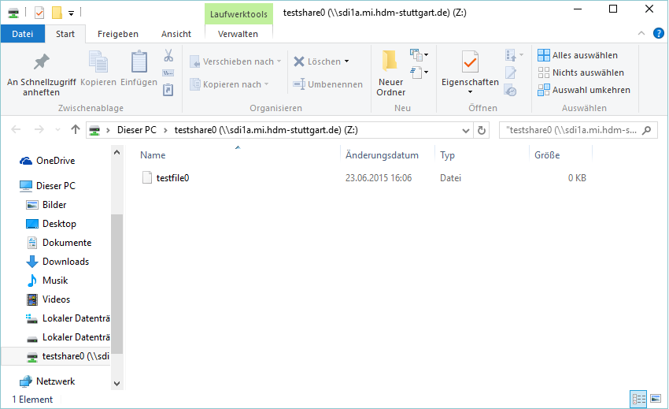

*****
Samba
*****

Samba Introduction
******************

Der Name Samba stammt vom Server Message Block-Protokoll (SMB).
Mithilfe von Samba können Daten (Verzeichnisse, Laufwerke, Festplatten) sowie Geräte (zb. Drucker) im Netzwerk geteilt werden.
Diese sogenannten Freigaben tauchen dann zB. in der Windows-Netzwerkumgebung auf und können eingebunden werden.
Unter Linux könnendiese Freigaben ebenfalls gemountet werden.

Samba kann daher in gemischten Netzen (Windows & Linux) sowie homogenen Netzwerken zum Datenaustausch eingesetzt werden.
Samba ist unter Linux sozusagen das Bindeglied zu anderen Betriebssystemen.

Die Bezeichnung "Samba-Server" bezeichnet den Rechner, der die Freigaben zur Verfügung stellt.
Der "Samba-Klient" ist der Rechner, welcher die Freigaben einbindet.
Ein Server kann mehrere Verzeichnisse für verschiedene Benutzer freigeben, so dass jeder Benutzer eine eigene Freigabe hat.
Falls nun ein Klient eine Freigabe einbinden will, so muss er sich zunächst gegenüber dem Server authentifizieren.

Exercises
*********

Setup des Samba-Servers
#######################

Der Samba Server wird mit dem Befehl
::
  apt-get install samba

installiert.

Anschließend können Benutzer hinzugefügt werden. Dies geschieht mit dem Befehl ``smbpasswd -a %username%``.

Hierfür ist es notwendig, dass auf dem System Linux Benutzer mit dem entsprechenden Benutzernamen angelegt ist. Benutzer können mit dem Befehl ``useradd --create-home %username%`` angelegt werden. Mit dem Parameter ``--create-home`` wird gleichzeitig ein Homeverzeichnis angelegt.
::
  root@sdi1a:~# useradd --create-home testuser0

Zur Erstellung des Samba-Users:
::
  root@sdi1a:~# smbpasswd -a testuser0
  New SMB password:
  Retype new SMB password:
  Added user testuser0.

Man muss ein Passwort angeben, da Samba nicht die Standard-Linux-Passwörter nutzt, sondern eigene Passwörter.
Das Passwort-Backend steht in der Samba-Konfigurationsdatei smb.conf:
``passdb backend = tdbsam``

Samba verwendet eine eigene Passwortdatenbank, da diese mit Windows-Passwörtern kompatibel sein muss.

Erklärung zu tdbsam:
::
  This backend provides a rich database backend for local servers.
  This backend is not suitable for multiple domain controllers (i.e., PDC + one or more BDC) installations.
   The tdbsam password backend stores the old smbpasswd information plus the extended MS Windows NT/200x SAM information into a binary format TDB (trivial database) file.
  The inclusion of the extended information makes it possible for Samba-3 to implement the same account and system access controls that are possible with MS Windows NT4/200x-based systems.

Diese werden unter  ``/var/lib/samba/private/passdb`` gespeichert:
::
  root@sdi1a:~# pdbedit -Lw
  testuser0:1000:XXXXXXXXXXXXXXXXXXXXXXXXXXXXXXXX:BD2A15934DF3DD824C3AC7B2E0546EBC:[U          ]:LCT-558970F7:
  testuser1:1001:XXXXXXXXXXXXXXXXXXXXXXXXXXXXXXXX:1120ACB74670C7DD46F1D3F5038A5CE8:[U          ]:LCT-5589712E:
  testuser2:1002:XXXXXXXXXXXXXXXXXXXXXXXXXXXXXXXX:4F597A08786530135E227AC1A579A54C:[U          ]:LCT-55897136:

Wenn in der Datei ``/etc/samba/smb.conf`` der Parameter ``unix password sync = yes`` gesetzt ist, so werden die Unix-Passwörter mit den Samba-Passwörtern synchronisiert.
Das heißt, dass wenn das Samba-Passwort mittels smbpasswd geändert wird, dann wird auch das Unix-Passwort geändert.
Auf die gleiche Weise wurden mehrere Samba-Benutzer für verschiedene Linux-User angelegt.

Samba user können nun mit dem Befehl ``pdbedit -L -v`` aufgelistet werden:
::
  root@sdi1a:~# pdbedit -L -v
  ---------------
  Unix username:        testuser0
  NT username:          testuser0
  Account Flags:        [U          ]
  User SID:             S-1-5-21-191455238-2906638316-4037938886-1003
  Primary Group SID:    S-1-5-21-191455238-2906638316-4037938886-1002
  Full Name:            testuser0
  Home Directory:       \\PDC-SRV\testuser0
  HomeDir Drive:        H:
  Logon Script:         logon.bat
  Profile Path:         \\PDC-SRV\profiles\testuser0
  Domain:               SDI1A
  Account desc:
  Workstations:
  Munged dial:
  Logon time:           0
  Logoff time:          Tue, 19 Jan 2038 03:14:07 UTC
  Kickoff time:         Tue, 19 Jan 2038 03:14:07 UTC
  Password last set:    Tue, 23 Jun 2015 14:45:11 UTC
  Password can change:  Tue, 23 Jun 2015 14:45:11 UTC
  Password must change: never
  Last bad password   : 0
  Bad password count  : 0
  Logon hours         : FFFFFFFFFFFFFFFFFFFFFFFFFFFFFFFFFFFFFFFFFF
  ---------------
  Unix username:        testuser1
  NT username:          testuser1
  Account Flags:        [U          ]
  User SID:             S-1-5-21-191455238-2906638316-4037938886-1004
  Primary Group SID:    S-1-5-21-191455238-2906638316-4037938886-513
  Full Name:            testuser1
  Home Directory:       \\PDC-SRV\testuser1
  HomeDir Drive:        H:
  Logon Script:         logon.bat
  Profile Path:         \\PDC-SRV\profiles\testuser1
  Domain:               SDI1A
  Account desc:
  Workstations:
  Munged dial:
  Logon time:           0
  Logoff time:          Tue, 19 Jan 2038 03:14:07 UTC
  Kickoff time:         Tue, 19 Jan 2038 03:14:07 UTC
  Password last set:    Tue, 23 Jun 2015 14:46:06 UTC
  Password can change:  Tue, 23 Jun 2015 14:46:06 UTC
  Password must change: never
  Last bad password   : 0
  Bad password count  : 0
  Logon hours         : FFFFFFFFFFFFFFFFFFFFFFFFFFFFFFFFFFFFFFFFFF

Freigabe von Ordnern
####################
Die Konfiguration zur Freigabe von Ordnern befindet sich in der Datei ``/etc/samba/smb.conf``.
Um beispielsweise das Verzeichnis ``/home/testuser0/shared`` freizugeben, muss in der Konfigurationsdatei folgender Block hinzugefügt werden:
::
  [testshare0]
  path = /home/testuser0/shared
  available = yes
  valid users = testuser0 #Nur testuser0 kann auf dieses Verzeichnis zugreifen.
  read only = no
  browseable = yes
  public = yes

Der Bezeichner innerhalb der eckigen Klammern ist der Name des Shares. In diesem Fall also **testshare0**.
Die Parameter im Detail:

.. glossary::
	path
	      Der Freizugebende Pfad

	available
  		dient als "Schalter" für das Share. Wird der Parameter auf **no** gesetzt, schlagen alle Versuche auf das Share zuzugreifen fehl.

  	valid users
  		Eine mit Kommas getrennte Liste an Benutzern, die auf das Share zugreifen dürfen; Andersherum können einzelne Benutzer mit dem Parameter **invalid users** vom Zugriff ausgeschlossen werden.

  	read only
  		Legt fest, ob die zugelassenen Benutzer Schreibzugriff auf das Share haben

  	browsesable
  		Ist diese Option auf "no" gesetzt, wird das Share niemals aufgelistet. Es ist also nur möglich direkt per Pfad auf das Share zuzugreifen.

  	public
  		Legt fest, ob für den Zugriff auf das Share ein Passwort benötigt wird.

Nach einem Serverneustart mit ``service smbd restart`` kann auf den Ordner über den Pfad ``\\sdi1a.mi.hdm-stuttgart.de\testshare0\`` zugegriffen werden.

Die Konfiguration kann mit dem Befehl ``testparm`` überprüft werden:
::
  root@sdi1a:~# testparm
  Load smb config files from /etc/samba/smb.conf
  rlimit_max: increasing rlimit_max (1024) to minimum Windows limit (16384)
  Processing section "[homes]"
  Processing section "[printers]"
  Processing section "[print$]"
  Processing section "[testshare0]"
  Processing section "[testshare1]"
  Processing section "[testshare2]"
  Loaded services file OK.
  Server role: ROLE_STANDALONE
  Press enter to see a dump of your service definitions

Falls die Konfiguration fehlerhaft ist (zum Beispiel fehlendes [ in einem share), so wird dies angezeigt:
::
  root@sdi1a:~# testparm                 
  Load smb config files from /etc/samba/smb.conf
  rlimit_max: increasing rlimit_max (1024) to minimum Windows limit (16384)
  Processing section "[homes]"
  Processing section "[printers]"
  Processing section "[print$]"
  params.c:Parameter() - Ignoring badly formed line in configuration file: testshare0]
  Processing section "[testshare1]"
  Processing section "[testshare2]"
  Loaded services file OK.
  Server role: ROLE_STANDALONE
  Press enter to see a dump of your service definitions

Informationen zu einzelnen Samba-Usern können mit ``smbclient`` abgerufen werden.
::
  root@sdi1a:/home# smbclient -L localhost --user testuser0
  Enter testuser0's password:
  Domain=[WORKGROUP] OS=[Unix] Server=[Samba 4.1.6-Ubuntu]

  	Sharename       Type      Comment
  	---------       ----      -------
	print$          Disk      Printer Drivers
	testshare0      Disk
	testshare1      Disk
	testshare2      Disk
	IPC$            IPC       IPC Service (sdi1a server (Samba, Ubuntu))
  	testuser0       Disk      Home Directories
  Domain=[WORKGROUP] OS=[Unix] Server=[Samba 4.1.6-Ubuntu]

	Server               Comment
	---------            -------
	SDI1A                sdi1a server (Samba, Ubuntu)

	Workgroup            Master
	---------            -------
	WORKGROUP            SDI1A

Mounten von shares
##################

Windows
+++++++
Der freigegebene ``shared``-Ordner kann folgendermaßen in Windows eingebunden werden.
Im Arbeitsplatz im Reiter "Computer" die Option "Netzwerkaufwerk verbinden" wählen.

Im erscheinenden Dialog den Laufwerkbuchstaben wähen und den Pfad eingeben und mit "Fertig stellen" bestätigen.

Die korrekten Login-Daten angeben.

.. image:: images/Samba/windows/03.bmp

Der Ordner erscheint nun in Form eines Netzwerklauferks im Arbeitsplatz.

Linux
+++++

Mithilfe des mount-Kommandos können die freigegebenen Shares im Zielverzeichnis /mnt/test/ eingehängt werden:
::
  sudo mount -t cifs  //sdi1a.mi.hdm-stuttgart.de/testshare0 /mnt/test/ -ouser=testuser0

Außerdem ist es möglich, alle Homedirectorys der Benutzer freizugeben.Hierfür müssen in der ``smb.conf`` die Kommentare vor dem folgendem Eintrag entfernt werden:
::
  [homes]
     comment = Home Directories
     browseable = no

Falls nun ein Klient versucht, sich mit einer Freigabe zu verbinden, die nicht explizit in der smb.conf definiert wurde, zb. "testuser0", so durchsucht der Samba-Server das Password-Database-File nach einem User "testuser0".
Falls dieser gefunden wird und das vom Klienten eingegebene Passwort mit demUnix-PW vom User "testuser0" übereinstimmt, so wird eine neue Freigabe mit dem Namen "testuser0" erzeugt, welcher auf testuser0's Home-Directory zeigt.
Beispielhaftes mount-Kommando für das mounten der Home-Directory von "testuser0":
::
  sudo mount -t cifs  //sdi1a.mi.hdm-stuttgart.de/testuser0 /mnt/test/ -ouser=testuser0

Verknüpfung mit einem LDAP-Server
#################################

Zunächst müssen diverse Packages installiert werden:
::
  sudo apt-get install samba samba-doc smbldap-tools

Samba LDAP Schema
+++++++++++++++++

Nun muss das Samba LDAP Schema auf den LDAP-Server angewendet werden, so dass OpenLDAP als Backend von Samba verwendet werden kann, da der Samba-Server nach spezifischen Einträgen im DIT sucht.

Der DIT braucht hierbei neue objectClasses, welche die nötigen Samba-Attribute beinhalten.
Diese objectClasses sind im Samba LDAP Schema beschrieben.

Entpacken des Schemas:
::
  sudo cp /usr/share/doc/samba-doc/examples/LDAP/samba.schema.gz /etc/ldap/schema
  sudo gzip -d /etc/ldap/schema/samba.schema.gz

Erstellen einer Datei "schema_convert.conf":
::
  include /etc/ldap/schema/core.schema
  include /etc/ldap/schema/collective.schema
  include /etc/ldap/schema/corba.schema
  include /etc/ldap/schema/cosine.schema
  include /etc/ldap/schema/duaconf.schema
  include /etc/ldap/schema/dyngroup.schema
  include /etc/ldap/schema/inetorgperson.schema
  include /etc/ldap/schema/java.schema
  include /etc/ldap/schema/misc.schema
  include /etc/ldap/schema/nis.schema
  include /etc/ldap/schema/openldap.schema
  include /etc/ldap/schema/ppolicy.schema
  include /etc/ldap/schema/ldapns.schema
  include /etc/ldap/schema/pmi.schema
  include /etc/ldap/schema/samba.schema

Erstellen einer Output-Directory:
::
  mkdir ldif_output

Ermitteln des korrekten Index des Schemas:
::
  slapcat -f schema_convert.conf -F ldif_output -n 0 | grep samba,cn=schema

  dn: cn={14}samba,cn=schema,cn=config

Konvertieren des Schemas ins LDIF-Format:
::
  slapcat -f schema_convert.conf -F ldif_output -n0 -H \
  ldap:///cn={14}samba,cn=schema,cn=config -l cn=samba.ldif

slapcat ist das Kommando, welches benutzt werden kann um die Inhalte einer slapd-Datenbank in das LDIF-Format umzuwandeln.

Parameter:

.. glossary::

	-f
		Definiert Konfigurationsdatei
	-F
		Definiert Konfigurations-Directory. Die mit -f definierte Datei wird in eine Verzeichnisstruktur umgewandelt und das Zielverzeichnis gespeichert
	-H
		Hier wird die LDAP-URI definiert.
	-l
		Ziel-LDIF-Datei

Anschließend muss noch die Index- Information aus der generierten LDIF- Datei entfernt werden.
Am Ende der Datei müssen die Zeilen
::
  structuralObjectClass: olcSchemaConfig
  entryUUID: b53b75ca-083f-102d-9fff-2f64fd123c95
  creatorsName: cn=config
  createTimestamp: 20080827045234Z
  entryCSN: 20080827045234.341425Z#000000#000#000000
  modifiersName: cn=config
  modifyTimestamp: 20080827045234Z
ebenfalls gelöscht werden.

Diese zwei Änderungen müssen gemacht werden, da das Output-LDIF nicht kompatibel mit dem Kommando ldapadd ist.
Erweitern des bestehenden Schemas auf dem LDAP-Server durch das generierte Schema:
::
  sudo ldapadd -Q -Y EXTERNAL -H ldapi:/// -f cn\=samba.ldif

Samba Indizes
+++++++++++++

OpenLDAP kennt nun Samba-Attribute, nun können noch Indizes für diese hinzugefügt werden, um die Performanz zu verbessern.

Eine neue Datei "samba_indices.ldif" wurde hierzu erstellt:
::
  dn: olcDatabase={1}hdb,cn=config
  changetype: modify
  add: olcDbIndex
  olcDbIndex: uidNumber eq
  olcDbIndex: gidNumber eq
  olcDbIndex: loginShell eq
  olcDbIndex: uid eq,pres,sub
  olcDbIndex: memberUid eq,pres,sub
  olcDbIndex: uniqueMember eq,pres
  olcDbIndex: sambaSID eq
  olcDbIndex: sambaPrimaryGroupSID eq
  olcDbIndex: sambaGroupType eq
  olcDbIndex: sambaSIDList eq
  olcDbIndex: sambaDomainName eq
  olcDbIndex: default sub

Die erstellten neuen Indizes können per
::
  sudo ldapmodify -Q -Y EXTERNAL -H ldapi:/// -f samba_indices.ldif
geladen werden.

Hinzufügen von Samba LDAP Objekten
++++++++++++++++++++++++++++++++++

Nun sollen die für Samba notwendigen Objekte in den DIT eingefügt werden.
Dies wird mithilfe des Packages "smbldap-tools" realisiert.

Zunächst wird ein Backup des aktuellen DIT erstellt, für den Fall dass etwas schief geht.
::
  slapcat -l backup.ldif

Anschließend werden die Objekte mithilfe des Kommandos
::
  smbldap-populate
erzeugt.

Anmerkung:

Aufgrund eines Fehlers wurden die von smbldap-populate verwendeten Skripte nicht korrekt erzeugt.
Als Notlösung wurden uns diese von Hr. Goik zur Verfügung gestellt, mussten jedoch noch manuell konfiguriert werden:

In smbldap_bind.conf müssen die korrekten Credentials für den Root-Zugang des LDAP-Servers hinterlegt werden:
::
  masterDN="cn=admin,dc=mi,dc=hdm-stuttgart,dc=de"
  masterPw="test"
  slaveDN="cn=admin,dc=mi,dc=hdm-stuttgart,dc=de"
  slavePw="test"

In smbldap.conf müssen einiger Parameter angepasst werden:
::
  SID="S-1-5-21-191455238-2906638316-4037938886"	//Eigene SID einfügen
  ldapTLS="0" 						//Deaktivieren von TLS
  suffix="dc=mi,dc=hdm-stuttgart,dc=de"			//Korrekter LDAP-Suffix

Samba Konfiguration
+++++++++++++++++++

Nun muss lediglich Samba so konfiguriert werden, dass LDAP zur Authentifizierung verwendet wird.

Dazu werden in der Datei /etc/samba/smb.conf die folgenden Parameter eingefügt:
::
  passdb backend = ldapsam:ldap://sdi1a.mi.hdm-stuttgart.de
  ldap suffix = dc=mi,dc=hdm-stuttgart,dc=de
  ldap user suffix = ou=People
  ldap group suffix = ou=Groups
  ldap machine suffix = ou=Computers
  ldap idmap suffix = ou=Idmap
  ldap admin dn = cn=admin,dc=mi,dc=hdm-stuttgart,dc=de
  ldap passwd sync = yes
  ldap ssl = off      #WICHTIG, da wir TLS bei LDAP deaktiviert haben

Nun muss Samba neu gestartet werden:
::
  restart smbd
  restart nmbd

Samba benötigt noch das Passwort für den Root-DN:
::
  smbpasswd -w test

Nun kann ein neuer User in das LDAP-Verzeichnis eingefügt werden:
::
  smbldap-useradd -a -P testuser4

Hinzufügen bestehender LDAP-User mit
::
  smbpasswd -a testuser4

NSS-Client
++++++++++

Wenn Samba mit einer LDAP-Authentifizierung funktionieren soll, so muss sichergestellt werden, dass die LDAP-User für das Host-OS sichtbar sind.

Um dies zu ermöglichen muss das Paket libnss-ldapd installiert werden:
::
  apt-get install libnss-ldapd

Nun muss in der Datei /etc/nssswitch.conf ldap als weitere Ressource angegeben werden:
::
  1 # /etc/nsswitch.conf
  2 #
  3 # Example configuration of GNU Name Service Switch functionality.
  4 # If you have the `glibc-doc-reference' and `info' packages installed, try:
  5 # `info libc "Name Service Switch"' for information about this file.
  6
  7 passwd:         files ldap
  8 group:          files ldap
  9 shadow:         files ldap
  10
  11 hosts:          files dns ldap
  12 networks:       files
  13
  14 protocols:      db files
  15 services:       db files
  16 ethers:         db files
  17 rpc:            db files
  18
  19 netgroup:       nis
  20 aliases:        ldap

Außerdem muss die Adresse des LDAP-Servers in der Datei nslcd.conf angegeben werden:
::
  1 # /etc/nslcd.conf
  2 # nslcd configuration file. See nslcd.conf(5)
  3 # for details.
  4
  5 # The user and group nslcd should run as.
  6 uid nslcd
  7 gid nslcd
  8
  9 # The location at which the LDAP server(s) should be reachable.
  10 uri ldapi:///141.62.75.101
  11
  12 # The search base that will be used for all queries.
  13 base dc=mi,dc=hdm-stuttgart,dc=de

Nun ist der nur im LDAP-Verzeichnis vorhandene User testuser4 im OS sichtbar:
::
  root@sdi1a:/var/log/samba# id testuser4
  uid=1005(testuser4) gid=513(Domain Users) groups=513(Domain Users)

Ergebnis
++++++++

Wenn der testuser4 Zugriff auf einen share erhält (via /etc/samba/smb.conf) so kann sich dieser beim mounten über LDAP authentifizieren.

Anmerkung:
Es kann passieren, dass beim Mounten die Fehlermeldung "Key Expired" auftritt.
In diesem Fall muss dass LDAP-Attribut "maxShadow" gelöscht im jeweiligen User gelöscht werden.

Möglichkeiten zur Fehlerbehandlung in Samba/LDAP
#######################################################

Logdateien
++++++++++

Alle Logdateien werden unter ``/var/log/samba/`` gespeichert.
Die Logging-Einstellungen befinden sich in der Datei ``/etc/samba/smb.conf`` in der Section Debugging:
::
  #### Debugging/Accounting ####

  # This tells Samba to use a separate log file for each machine
  # that connects
    log file = /var/log/samba/log.%m

  # Cap the size of the individual log files (in KiB).
     max log size = 1000

  # If you want Samba to only log through syslog then set the following
  # parameter to 'yes'.
  #   syslog only = no

  # We want Samba to log a minimum amount of information to syslog. Everything
  # should go to /var/log/samba/log.{smbd,nmbd} instead. If you want to log
  # through syslog you should set the following parameter to something higher.
     syslog = 0

  # Do something sensible when Samba crashes: mail the admin a backtrace
     panic action = /usr/share/samba/panic-action %d

Mit diesen Einstellungen wird für jeden Klienten eine Logdatei erstellt:
::
  root@sdi1a:/var/log/samba# ls
  cores                log.192.168.222.234  log.smbd
  log.                 log.nmbd             log.smbd.1.gz
  log.%m               log.nmbd.1.gz        log.smbd.2.gz
  log.127.0.0.1        log.nmbd.2.gz        log.smbd.3.gz
  log.192.168.222.102  log.nmbd.3.gz        log.smbd.4.gz
  log.192.168.222.126  log.paul-pc          log.smbd.old
  log.192.168.222.226  log.sdi1a            log.win-1gp29bt5kvn

Welche Logging-Informationen in dieser Datei gespeichert werden, hängt vom Log-Level ab.
Dieser wurde in der obigen Konfiguration nicht explizit gesetzt, ist daher per default auf 1 gestellt. Das heißt, dass nur sehr wenige Informationen geloggt werden. In diesem Fall lediglich die Verbindung selbst.

Wenn Fehler auftreten kann der Log-Level höher gestellt werden, damit mehr Informationen gespeichert werden, z.B.: ``log level = 3``

Der Log-Level sollte dabei 3 nicht überschreiten, da ansonsten sehr viele Informationen gespeichert werden.

smbcontrol
++++++++++

Mithilfe des Tools smbcontrol können bereits bestehende Samba-Verbindungen beeinflusst werden (z.B. Log-Level ändern).

Dazu wird zunächst die PID des smbd benötigt:
::
  #Aussschnitt aus root@sdi1a:~# smbstatus :
  Samba version 4.1.6-Ubuntu
  PID     Username      Group         Machine
  -------------------------------------------------------------------
  21420     testuser0     testuser0     192.168.222.126 (ipv4:192.168.222.126:57135)

  Service      pid     machine       Connected at
  -------------------------------------------------------
  testshare0   21420   192.168.222.126  Sat Jun 27 10:13:56 2015
  IPC$         21420   192.168.222.126  Sat Jun 27 10:13:56 2015

Nun kann der Log-Level angepasst werden:

``smbcontrol 21420 debug 3``

Logging in LDAP
+++++++++++++++

Auch der LDAP-Server kann Logdateien erstellen.
Dazu muss zunächst der Loglevel mittels einer .ldif-Datei eingestellt werden:
::
  dn: cn=config
  changetype: modify
  replace: olcLogLevel
  olcLogLevel: stats

LDIF-Datei auf LDAP-Datenbank anwenden:
``ldapmodify -Q -Y EXTERNAL -H ldapi:/// -f loglevel.ldif``

Anschließend können die LDAP-Logs auf der Konsole angezeigt werden:
::
  root@sdi1a:~# cd /var/log
  root@sdi1a:/var/log# tail /var/log -n0 -f `find . -type f`
  [...]
  Jul  1 07:45:28 sdi1a slapd[2596]: conn=12171 op=27 SRCH base="dc=mi,dc=hdm-stuttgart,dc=de" scope=2 deref=0 filter="(&(uid=testuser0)(objectClass=sambaSamAccount))"
  Jul  1 07:45:28 sdi1a slapd[2596]: conn=12171 op=27 SRCH attr=uid uidNumber gidNumber homeDirectory sambaPwdLastSet sambaPwdCanChange sambaPwdMustChange sambaLogonTime sambaLogoffTime sambaKickoffTime cn sn displayName sambaHomeDrive sambaHomePath sambaLogonScript sambaProfilePath description sambaUserWorkstations sambaSID sambaPrimaryGroupSID sambaLMPassword sambaNTPassword sambaDomainName objectClass sambaAcctFlags sambaMungedDial sambaBadPasswordCount sambaBadPasswordTime sambaPasswordHistory modifyTimestamp sambaLogonHours modifyTimestamp uidNumber gidNumber homeDirectory loginShell gecos
  Jul  1 07:45:28 sdi1a slapd[2596]: conn=12171 op=27 SEARCH RESULT tag=101 err=0 nentries=1 text=
  Jul  1 07:45:28 sdi1a slapd[2596]: conn=12171 op=28 SRCH base="dc=mi,dc=hdm-stuttgart,dc=de" scope=2 deref=0 filter="(&(objectClass=sambaGroupMapping)(gidNumber=1000))"
  Jul  1 07:45:28 sdi1a slapd[2596]: conn=12171 op=28 SRCH attr=gidNumber sambaSID sambaGroupType sambaSIDList description displayName cn objectClass
  Jul  1 07:45:28 sdi1a slapd[2596]: conn=12171 op=28 SEARCH RESULT tag=101 err=0 nentries=1 text=
  Jul  1 07:45:28 sdi1a slapd[2596]: conn=12171 op=29 SRCH base="dc=mi,dc=hdm-stuttgart,dc=de" scope=2 deref=0 filter="(&(sambaSID=s-1-5-21-191455238-2906638316-4037938886-1002)(objectClass=sambaSamAccount))"
  Jul  1 07:45:28 sdi1a slapd[2596]: conn=12171 op=29 SRCH attr=uid uidNumber gidNumber homeDirectory sambaPwdLastSet sambaPwdCanChange sambaPwdMustChange sambaLogonTime sambaLogoffTime sambaKickoffTime cn sn displayName sambaHomeDrive sambaHomePath sambaLogonScript sambaProfilePath description sambaUserWorkstations sambaSID sambaPrimaryGroupSID sambaLMPassword sambaNTPassword sambaDomainName objectClass sambaAcctFlags sambaMungedDial sambaBadPasswordCount sambaBadPasswordTime sambaPasswordHistory modifyTimestamp sambaLogonHours modifyTimestamp uidNumber gidNumber homeDirectory loginShell gecos
  [...]
